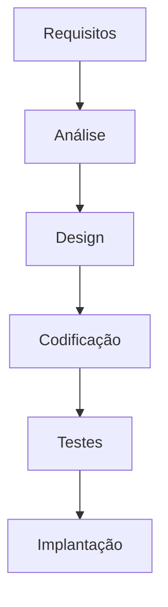

# 🚀 Agilidade no Desenvolvimento de Software

## 📚 Sumário
- [Introdução: Por que precisamos falar sobre Agilidade?](#introdução-por-que-precisamos-falar-sobre-agilidade)
- [O Jeito Antigo: O Modelo Cascata (Waterfall)](#o-jeito-antigo-o-modelo-cascata-waterfall)
- [A Revolução Ágil: O Manifesto que Mudou Tudo](#a-revolução-ágil-o-manifesto-que-mudou-tudo)
- [Scrum: O Framework Ágil Mais Popular](#scrum-o-framework-ágil-mais-popular)
- [Kanban: O Sistema de Fluxo Visual](#kanban-o-sistema-de-fluxo-visual)
- [XP (Extreme Programming): A Excelência Técnica](#xp-extreme-programming-a-excelência-técnica)
- [Comparando as Metodologias: Qual Escolher?](#comparando-as-metodologias-qual-escolher)
- [Conclusão: Juntando as Peças](#conclusão-juntando-as-peças)
- [Glossário Rápido](#glossário-rápido)
- [Perguntas para Fixação](#perguntas-para-fixação)

## 🎯 Introdução: Por que precisamos falar sobre Agilidade?

### A Metáfora do Carro e da Caminhonete

Imagine que um cliente pede para você construir um carro. Você passa seis meses em planejamento detalhado: o motor V8, o design aerodinâmico, a cor vermelha Ferrari. Depois de mais seis meses de construção, você entrega uma obra de arte. Mas o cliente diz: 

> "Nossa, é incrível, mas nesse tempo eu me mudei para o campo, tive filhos e agora preciso de uma caminhonete 4x4 para levar a família e as compras."

Você entregou exatamente o que foi pedido no início, mas o produto final não serve mais. O problema não foi sua competência técnica, mas o processo. O mundo da tecnologia e as necessidades dos clientes mudam rápido demais.

> 💡 **Importante**: Agilidade não é sobre ser mais rápido, mas sobre ser mais adaptável. É sobre construir o produto em pequenas partes, mostrar para o cliente, obter feedback e ajustar o rumo constantemente.

## 🌊 O Jeito Antigo: O Modelo Cascata (Waterfall)

Antes da agilidade, o modelo mais comum era o Cascata. O nome já diz tudo: o trabalho flui como uma cachoeira, de cima para baixo, em fases rígidas.

### Como funciona?

O projeto passa por etapas sequenciais. Uma fase só começa quando a anterior está 100% concluída:



### Quais os problemas?

❌ **Rígido**: Mudar um requisito no meio do projeto é extremamente caro e difícil.

❌ **Lento**: O cliente só vê o produto funcionando no final, meses ou anos depois.

❌ **Arriscado**: E se, no final, o cliente não gostar? Ou se o mercado mudou e o software se tornou irrelevante?

## 📜 A Revolução Ágil: O Manifesto que Mudou Tudo

Em 2001, um grupo de desenvolvedores se cansou do modelo Cascata e criou o Manifesto para o Desenvolvimento Ágil de Software.

### Os 4 Valores Fundamentais

| Valorizamos mais... | Do que... |
|-------------------|-----------|
| 👥 **Indivíduos e interações** | Processos e ferramentas |
| 💻 **Software em funcionamento** | Documentação abrangente |
| 🤝 **Colaboração com o cliente** | Negociação de contratos |
| 🔄 **Responder a mudanças** | Seguir um plano |

> 💡 **Fique de Olho**: A agilidade valoriza mais os itens à esquerda, mas não significa que os itens à direita não tenham valor.

## 🎯 Gerenciando o Trabalho Ágil: Scrum e Kanban

### 💡 Exemplo Prático: Desenvolvimento de um App de Delivery

Vamos imaginar que estamos construindo um aplicativo de delivery de comida. Veja como seria a abordagem ágil:

**Product Backlog Inicial:**
```
- Usuários podem ver lista de restaurantes
- Usuários podem fazer pedidos
- Restaurantes podem aceitar/rejeitar pedidos
- Sistema de pagamento
- Rastreamento do entregador
- Sistema de avaliação
```

**Sprint 1 (MVP - Produto Mínimo Viável):**
- ✅ Lista básica de restaurantes
- ✅ Fazer pedido via WhatsApp
- ⏳ Confirmação manual por telefone

**Feedback do Cliente após Sprint 1:**
> "Ótimo! Mas os clientes estão pedindo para ver o cardápio dos restaurantes antes."

**Ajuste no Backlog:**
- 🔄 Adicionar cardápios digitais (nova prioridade)
- ⬇️ Sistema de rastreamento (menos prioritário agora)

Isto demonstra como a agilidade permite:
1. Entregar valor rapidamente (app funcionando em 2 semanas)
2. Adaptar baseado no feedback real
3. Priorizar o que realmente importa

## 🏃‍♂️ Scrum: O Framework Ágil Mais Popular

### 🎯 O que é Scrum?

Scrum é um framework ágil que permite que as equipes trabalhem de forma colaborativa e iterativa para entregar valor ao cliente. Baseado na teoria de controle empírico de processos, o Scrum reconhece que o conhecimento vem da experiência e da tomada de decisões baseada no que é conhecido.

### 🧠 Princípios Fundamentais do Scrum

#### 1. **Transparência (Transparency)**
- Todos os aspectos do processo devem ser visíveis para todos os envolvidos
- Linguagem comum compartilhada por todos
- Definições claras de "Pronto" (Definition of Done)

#### 2. **Inspeção (Inspection)**
- Verificação frequente dos artefatos e progresso
- Detecção de desvios indesejados
- Não deve ser tão frequente a ponto de atrapalhar o trabalho

#### 3. **Adaptação (Adaptation)**
- Ajustes quando a inspeção revela que um ou mais aspectos estão fora dos limites aceitáveis
- Mudanças devem ser implementadas o mais rapidamente possível

### 👥 Papéis no Scrum

#### **Product Owner (PO)**
**Responsabilidades:**
- Maximizar o valor do produto resultante do trabalho do Scrum Team
- Gerenciar o Product Backlog
- Garantir que o Product Backlog seja visível, transparente e claro
- Garantir que o Scrum Team entenda os itens do Product Backlog

**Características:**
- Representa a voz do cliente/stakeholder
- Única pessoa responsável por gerenciar o Product Backlog
- Pode delegar a responsabilidade, mas permanece responsável

**Exemplo Prático:**
```
PO de um E-commerce:
- Prioriza funcionalidades baseado no ROI
- Ajusta backlog baseado no feedback dos usuários
- Define critérios de aceitação para cada história
- Comunica visão do produto para o time
```

#### **Scrum Master (SM)**
**Responsabilidades:**
- Promover e apoiar o Scrum conforme definido no Scrum Guide
- Servir ao Product Owner, Development Team e organização
- Facilitar eventos Scrum quando solicitado ou necessário
- Treinar a organização em sua adoção do Scrum

**Características:**
- Líder servidor, não gerente
- Remove impedimentos
- Coach e mentor da equipe
- Protetor da equipe contra interferências externas

**Exemplo Prático:**
```
SM em Ação:
- Facilita Daily Scrum quando há conflitos
- Remove bloqueios com áreas externas (TI, Infraestrutura)
- Treina novos membros no processo Scrum
- Organiza retrospectivas produtivas
```

#### **Development Team**
**Responsabilidades:**
- Auto-organização para determinar como realizar o trabalho
- Cross-functional com todas as habilidades necessárias
- Responsável por entregar incrementos de produto "Prontos"
- Colaboração para atingir os objetivos do Sprint

**Características:**
- 3-9 pessoas
- Sem títulos hierárquicos
- Compartilha responsabilidade pelos resultados
- Auto-organizado

**Exemplo Prático:**
```
Time de Desenvolvimento:
- Frontend Developer
- Backend Developer
- QA Engineer
- DevOps Engineer
- UX/UI Designer
Todos colaboram para entregar funcionalidades completas.
```

### 🕒 Eventos do Scrum

#### **1. Sprint Planning**
**Objetivo:** Planejar o trabalho a ser realizado durante o Sprint.

**Duração:** Máximo de 8 horas para um Sprint de um mês.

**Participantes:** Product Owner, Scrum Master e Development Team.

**Agenda:**
- **Parte 1:** O que pode ser entregue no Sprint?
- **Parte 2:** Como será entregue o trabalho selecionado?

**Exemplo Prático:**
```
Sprint Planning para App de Delivery:
Parte 1:
- PO apresenta histórias priorizadas
- Time estima esforço (Story Points)
- Define Sprint Goal: "Usuários podem fazer pedidos online"

Parte 2:
- Time quebra histórias em tarefas técnicas
- Define responsabilidades
- Identifica dependências e riscos
```

#### **2. Daily Scrum**
**Objetivo:** Inspecionar o progresso em direção ao Sprint Goal e adaptar o Sprint Backlog conforme necessário.

**Duração:** Máximo de 15 minutos.

**Formato:** Cada membro responde três perguntas:
1. O que fiz ontem que ajudou o Development Team a atingir o Sprint Goal?
2. O que farei hoje para ajudar o Development Team a atingir o Sprint Goal?
3. Vejo algum impedimento que impeça o Development Team de atingir o Sprint Goal?

**Exemplo Prático:**
```
Daily Scrum - João (Frontend):
"Ontem: Implementei o formulário de pedido
Hoje: Vou integrar com a API de pagamento
Impedimento: API de pagamento está fora do ar"

SM: "Vou contatar o time de infraestrutura sobre a API"
```

#### **3. Sprint Review**
**Objetivo:** Inspecionar o incremento e adaptar o Product Backlog se necessário.

**Duração:** Máximo de 4 horas para um Sprint de um mês.

**Participantes:** Product Owner, Scrum Master, Development Team e stakeholders.

**Agenda:**
- Product Owner explica o que foi "Pronto"
- Development Team demonstra o trabalho
- Stakeholders fornecem feedback
- Product Backlog é atualizado

**Exemplo Prático:**
```
Sprint Review - App de Delivery:
- Demonstração: Usuário faz pedido completo
- Feedback: "Precisamos de confirmação por email"
- PO adiciona ao backlog: "Envio de confirmação por email"
- Discussão sobre próximas prioridades
```

#### **4. Sprint Retrospective**
**Objetivo:** Inspecionar como o último Sprint foi realizado em relação a pessoas, relacionamentos, processos e ferramentas.

**Duração:** Máximo de 3 horas para um Sprint de um mês.

**Agenda:**
- O que funcionou bem?
- O que poderia ser melhorado?
- O que vamos fazer diferente no próximo Sprint?

**Exemplo Prático:**
```
Retrospectiva:
✅ Funcionou bem:
- Pair programming para funcionalidades complexas
- Testes automatizados reduziram bugs

❌ Pode melhorar:
- Estimativas foram muito otimistas
- Falta de documentação técnica

🔄 Ações:
- Usar Planning Poker para estimativas
- Criar template de documentação
```

### 📦 Artefatos do Scrum

#### **Product Backlog**
**Definição:** Lista ordenada de tudo que é conhecido como necessário no produto.

**Características:**
- Evolui constantemente
- Ordenado por valor, risco e dependências
- Detalhado apenas o suficiente para planejamento
- Refinado continuamente

**Estrutura de uma História de Usuário:**
```
Como um [tipo de usuário],
Eu quero [funcionalidade],
Para que [benefício/valor].

Critérios de Aceitação:
- [ ] Critério 1
- [ ] Critério 2
- [ ] Critério 3

Estimativa: 8 Story Points
Prioridade: Alta
```

**Exemplo de Product Backlog:**
```
1. Como usuário, quero fazer login para acessar minha conta
   - Prioridade: Alta, Story Points: 5

2. Como usuário, quero ver lista de restaurantes próximos
   - Prioridade: Alta, Story Points: 8

3. Como usuário, quero fazer pedido online
   - Prioridade: Média, Story Points: 13

4. Como usuário, quero rastrear meu pedido
   - Prioridade: Baixa, Story Points: 8
```

#### **Sprint Backlog**
**Definição:** Conjunto de Product Backlog Items selecionados para o Sprint, mais um plano para entregar o incremento do produto e atingir o Sprint Goal.

**Características:**
- Visível para todos
- Atualizado durante o Sprint
- Propriedade do Development Team
- Inclui tarefas técnicas

**Exemplo de Sprint Backlog:**
```
Sprint Goal: Usuários podem fazer pedidos online

Histórias Selecionadas:
1. Login do usuário (5 SP)
   - Tarefas: Frontend, Backend, Testes, Documentação

2. Lista de restaurantes (8 SP)
   - Tarefas: API, Interface, Filtros, Testes

Total: 13 Story Points
```

#### **Incremento**
**Definição:** Soma de todos os Product Backlog Items completados durante um Sprint e todos os Sprints anteriores.

**Características:**
- Deve estar em estado utilizável
- Funcional e testado
- Pronto para produção
- Adiciona valor ao produto

### 📊 Métricas e Estimativas no Scrum

#### **Story Points**
**Definição:** Unidade de medida para estimar o esforço relativo de uma história.

**Escala Fibonacci:** 1, 2, 3, 5, 8, 13, 21, 34, 55, 89

**Como estimar:**
- Comparação relativa entre histórias
- Considerar complexidade, incerteza e esforço
- Consenso da equipe através de Planning Poker

**Exemplo de Estimativa:**
```
História Base: "Login simples" = 3 pontos

Comparações:
- "Login com 2FA" = 8 pontos (mais complexo)
- "Lista de restaurantes" = 5 pontos (similar)
- "Sistema de pagamento" = 13 pontos (muito mais complexo)
```

#### **Velocidade**
**Definição:** Soma dos Story Points das histórias completadas em um Sprint.

**Uso:**
- Planejamento de futuros Sprints
- Identificação de tendências
- Melhoria contínua

**Exemplo:**
```
Sprint 1: 15 Story Points completados
Sprint 2: 18 Story Points completados
Sprint 3: 16 Story Points completados

Velocidade média: ~16.3 SP por Sprint
Capacidade para próximo Sprint: 16-17 SP
```

## 📋 Kanban: O Sistema de Fluxo Visual

### 🎯 O que é Kanban?

Kanban é um método de gerenciamento de fluxo de trabalho que visualiza o trabalho, limita o trabalho em progresso (WIP) e maximiza a eficiência. Originário do sistema de produção Toyota, foi adaptado para desenvolvimento de software por David J. Anderson.

### 🧠 Princípios Fundamentais do Kanban

#### **1. Visualizar o Trabalho**
- Tornar visível todo o trabalho e seu fluxo
- Usar cartões, colunas e cores para representar estados
- Facilitar comunicação e colaboração

#### **2. Limitar o Trabalho em Progresso (WIP)**
- Estabelecer limites para cada coluna
- Prevenir sobrecarga da equipe
- Identificar gargalos rapidamente

#### **3. Gerenciar o Fluxo**
- Otimizar o fluxo de trabalho
- Reduzir tempo de ciclo
- Eliminar desperdícios

#### **4. Tornar Políticas Explícitas**
- Documentar regras e processos
- Padronizar procedimentos
- Facilitar treinamento e onboarding

#### **5. Implementar Ciclos de Feedback**
- Revisar e melhorar continuamente
- Coletar métricas e dados
- Ajustar processos baseado em evidências

#### **6. Melhorar Colaborativamente**
- Envolver toda a equipe nas melhorias
- Focar em mudanças evolutivas
- Celebrar sucessos e aprender com falhas

### 🎨 Estrutura do Quadro Kanban

#### **Colunas Básicas**
```
┌──────────────┐ ┌──────────────┐ ┌──────────────┐ ┌──────────────┐
│   Backlog    │ │   To Do      │ │  In Progress │ │    Done      │
│   (Sem WIP)  │ │   (WIP: 5)   │ │   (WIP: 3)   │ │   (Sem WIP)  │
└──────────────┘ └──────────────┘ └──────────────┘ └──────────────┘
```

#### **Colunas Avançadas (Desenvolvimento de Software)**
```
┌──────────────┐ ┌──────────────┐ ┌──────────────┐ ┌──────────────┐ ┌──────────────┐ ┌──────────────┐
│   Backlog    │ │   To Do      │ │Development   │ │   Testing    │ │   Review     │ │    Done      │
│   (Sem WIP)  │ │   (WIP: 5)   │ │ (WIP: 3)     │ │   (WIP: 2)   │ │   (WIP: 2)   │ │   (Sem WIP)  │
└──────────────┘ └──────────────┘ └──────────────┘ └──────────────┘ └──────────────┘ └──────────────┘
```

#### **Exemplo Detalhado com Cartões**
```
┌──────────────┐ ┌──────────────┐ ┌──────────────┐ ┌──────────────┐
│   Backlog    │ │   To Do      │ │  In Progress │ │    Done      │
│   (Sem WIP)  │ │   (WIP: 5)   │ │   (WIP: 3)   │ │   (Sem WIP)  │
├──────────────┤ ├──────────────┤ ├──────────────┤ ├──────────────┤
│ #123         │ │ #119         │ │ #117         │ │ #115         │
│ Login 2FA    │ │ Bug crítico  │ │ Nova feature │ │ Update SSL   │
│ 8 SP         │ │ 3 SP         │ │ 13 SP        │ │ 5 SP         │
│ João         │ │ Ana          │ │ Pedro        │ │ Maria        │
│ 🔴 Alta      │ │ 🔴 Crítico   │ │ 🟡 Média     │ │ 🟢 Baixa     │
├──────────────┤ ├──────────────┤ ├──────────────┤ ├──────────────┤
│ #122         │ │ #118         │ │ #116         │ │ #114         │
│ Dashboard    │ │ Backup falha │ │ Migração BD  │ │ Fix cache    │
│ 21 SP        │ │ 5 SP         │ │ 8 SP         │ │ 3 SP         │
│ Maria        │ │ João         │ │ Ana          │ │ Pedro        │
│ 🔴 Alta      │ │ 🔴 Crítico   │ │ 🟡 Média     │ │ 🟢 Baixa     │
└──────────────┘ └──────────────┘ └──────────────┘ └──────────────┘
```

### 🔢 Limites de WIP (Work in Progress)

#### **Por que Limitar WIP?**
- **Previne sobrecarga** da equipe
- **Identifica gargalos** rapidamente
- **Melhora qualidade** do trabalho
- **Reduz tempo de ciclo**
- **Aumenta foco** e produtividade

#### **Como Definir Limites de WIP**
**Método 1: Baseado na Capacidade**
```
Equipe de 6 pessoas:
- To Do: 6 (uma tarefa por pessoa)
- In Progress: 3 (50% da equipe)
- Testing: 2 (33% da equipe)
- Review: 2 (33% da equipe)
```

**Método 2: Baseado na Experiência**
```
Começar conservador:
- To Do: 5
- In Progress: 2
- Testing: 2
- Review: 1

Ajustar baseado nos resultados
```

#### **Exemplo de Ajuste de WIP**
```
Situação Inicial:
- In Progress: WIP 3
- Problema: Tarefas ficam paradas por falta de revisão

Ajuste:
- In Progress: WIP 2 (reduzido)
- Review: WIP 3 (aumentado)

Resultado: Fluxo mais equilibrado, menos gargalos
```

### 📊 Métricas do Kanban

#### **Tempo de Ciclo (Cycle Time)**
**Definição:** Tempo desde o início do trabalho até sua conclusão.

**Cálculo:** Data de conclusão - Data de início

**Exemplo:**
```
Tarefa #117:
- Iniciada: 15/10/2025
- Concluída: 22/10/2025
- Tempo de Ciclo: 7 dias

Média da equipe: 5.2 dias
```

#### **Lead Time**
**Definição:** Tempo desde a criação da tarefa até sua conclusão.

**Cálculo:** Data de conclusão - Data de criação

**Exemplo:**
```
Tarefa #117:
- Criada: 10/10/2025
- Concluída: 22/10/2025
- Lead Time: 12 dias

Média da equipe: 8.7 dias
```

#### **Throughput**
**Definição:** Número de tarefas concluídas por unidade de tempo.

**Cálculo:** Tarefas concluídas / Período de tempo

**Exemplo:**
```
Últimas 4 semanas:
- Semana 1: 5 tarefas
- Semana 2: 7 tarefas
- Semana 3: 6 tarefas
- Semana 4: 8 tarefas

Throughput médio: 6.5 tarefas/semana
```

#### **Cumulative Flow Diagram (CFD)**
**Gráfico que mostra o acúmulo de trabalho em cada coluna ao longo do tempo.**

**Interpretação:**
- **Linhas paralelas:** Fluxo estável
- **Linhas divergindo:** Gargalos se formando
- **Linhas convergindo:** Melhoria no fluxo

### 🚀 Implementação do Kanban

#### **Fase 1: Visualizar o Trabalho Atual**
1. **Mapear o processo atual**
2. **Identificar todas as colunas/estados**
3. **Criar o quadro visual**
4. **Colocar todas as tarefas atuais**

#### **Fase 2: Estabelecer Limites de WIP**
1. **Começar conservador**
2. **Monitorar o fluxo**
3. **Ajustar gradualmente**
4. **Documentar as mudanças**

#### **Fase 3: Gerenciar o Fluxo**
1. **Identificar gargalos**
2. **Implementar melhorias**
3. **Medir resultados**
4. **Iterar continuamente**

#### **Exemplo de Implementação Gradual**
```
Semana 1: Quadro básico com 3 colunas
Semana 2: Adicionar limites de WIP
Semana 3: Implementar métricas básicas
Semana 4: Adicionar colunas especializadas
Semana 5: Implementar políticas explícitas
Semana 6: Revisar e ajustar
```

### 🎯 Casos de Uso do Kanban

#### **Desenvolvimento de Software**
- **Controle de versão** e branches
- **Code review** e aprovações
- **Deploy** e releases
- **Suporte** e manutenção

#### **Suporte Técnico**
- **Tickets** de suporte
- **Níveis** de prioridade
- **Escalação** de problemas
- **Resolução** e fechamento

#### **Marketing e Design**
- **Campanhas** em andamento
- **Criação** de conteúdo
- **Revisão** e aprovação
- **Publicação** e monitoramento

### 🔍 Análise Avançada do Kanban

#### **Vantagens do Kanban**
✅ **Flexibilidade:** Adapta-se a qualquer processo existente
✅ **Visualização:** Facilita identificação de problemas
✅ **Melhoria contínua:** Foco em otimização do fluxo
✅ **Baixa barreira:** Fácil de implementar e adotar
✅ **Escalabilidade:** Funciona com equipes de qualquer tamanho

#### **Desafios do Kanban**
⚠️ **Disciplina:** Requer compromisso com limites de WIP
⚠️ **Métricas:** Pode ser difícil estabelecer KPIs relevantes
⚠️ **Mudança cultural:** Pode enfrentar resistência inicial
⚠️ **Over-engineering:** Risco de criar colunas desnecessárias

#### **Melhores Práticas**
🎯 **Começar simples:** 3-4 colunas no início
🎯 **Limites realistas:** Baseados na capacidade real da equipe
🎯 **Revisão regular:** Analisar métricas semanalmente
🎯 **Políticas claras:** Documentar regras de cada coluna
🎯 **Feedback contínuo:** Ajustar baseado nos resultados

## ⚡ XP (Extreme Programming): A Excelência Técnica

### 🎯 O que é XP?

Extreme Programming (XP) é uma metodologia ágil que enfatiza a qualidade do código através de práticas técnicas rigorosas. Criada por Kent Beck, XP é conhecida por suas práticas "extremas" que visam maximizar a qualidade e a produtividade.

### 🧠 Valores Fundamentais do XP

#### **1. Simplicidade (Simplicity)**
- Fazer o que é necessário, nada mais
- Evitar complexidade desnecessária
- Focar no valor imediato

#### **2. Comunicação (Communication)**
- Comunicação face a face
- Documentação através do código
- Compartilhamento de conhecimento

#### **3. Feedback (Feedback)**
- Feedback rápido e frequente
- Testes automatizados
- Integração contínua

#### **4. Coragem (Courage)**
- Refatorar quando necessário
- Admitir erros e aprender
- Tomar decisões difíceis

#### **5. Respeito (Respect)**
- Respeitar colegas e seu trabalho
- Valorizar o conhecimento da equipe
- Trabalhar em conjunto

### 🛠️ Práticas Técnicas do XP

#### **1. Pair Programming**
**Definição:** Dois desenvolvedores trabalhando juntos em uma mesma tarefa.

**Como Funciona:**
- **Piloto (Driver):** No teclado, escrevendo código
- **Navegador (Navigator):** Revisando, pensando estrategicamente, identificando problemas

**Vantagens:**
- **Qualidade superior:** Dois pares de olhos revisam o código
- **Conhecimento compartilhado:** Aprendizado contínuo
- **Menos bugs:** Detecção precoce de problemas
- **Design melhor:** Discussões sobre arquitetura

**Desvantagens:**
- **Custo aparente:** Dois desenvolvedores para uma tarefa
- **Fadiga:** Pode ser cansativo por longos períodos
- **Conflitos de personalidade:** Nem todos se dão bem

**Exemplo Prático:**
```
João (Piloto) e Maria (Navegadora) desenvolvendo API de pagamento:

João: "Vou criar a classe PaymentProcessor"
Maria: "Espera, precisamos validar os dados primeiro"
João: "Boa ideia, vou criar um validator"
Maria: "E como vamos tratar os erros de pagamento?"
João: "Vou implementar um sistema de retry"

Resultado: Código mais robusto e bem pensado
```

**Técnicas de Pair Programming:**
- **Ping-pong:** Alternar entre piloto e navegador
- **Driver-navigator:** Manter papéis fixos por sessão
- **Mob programming:** Mais de duas pessoas (para problemas complexos)

#### **2. Test-Driven Development (TDD)**
**Definição:** Desenvolvimento guiado por testes, seguindo o ciclo Red-Green-Refactor.

**Ciclo TDD:**
1. **🔴 RED:** Escrever teste que falha
2. **🟢 GREEN:** Implementar código mínimo para passar
3. **🔵 REFACTOR:** Melhorar o código mantendo os testes passando

**Exemplo Detalhado: Calculadora de IMC**

**Passo 1: 🔴 RED - Primeiro Teste**
```javascript
// test/imc.test.js
describe('Calculadora de IMC', () => {
    test('deve calcular IMC corretamente', () => {
        expect(calcularIMC(70, 1.75)).toBe(22.9);
        expect(calcularIMC(85, 1.80)).toBe(26.2);
    });
});
```

**Passo 2: 🟢 GREEN - Implementação Mínima**
```javascript
// src/imc.js
function calcularIMC(peso, altura) {
    return Number((peso / (altura * altura)).toFixed(1));
}

module.exports = { calcularIMC };
```

**Passo 3: 🔵 REFACTOR - Melhorar o Código**
```javascript
// src/imc.js
function calcularIMC(peso, altura) {
    // Validações
    if (peso <= 0 || altura <= 0) {
        throw new Error('Peso e altura devem ser positivos');
    }
    
    if (altura > 3) {
        throw new Error('Altura deve estar em metros (ex: 1.75)');
    }
    
    // Cálculo
    const imc = peso / Math.pow(altura, 2);
    return Number(imc.toFixed(1));
}

module.exports = { calcularIMC };
```

**Passo 4: 🔴 RED - Novos Testes**
```javascript
// test/imc.test.js
describe('Calculadora de IMC', () => {
    test('deve calcular IMC corretamente', () => {
        expect(calcularIMC(70, 1.75)).toBe(22.9);
        expect(calcularIMC(85, 1.80)).toBe(26.2);
    });
    
    test('deve lançar erro para valores inválidos', () => {
        expect(() => calcularIMC(0, 1.75)).toThrow('Peso e altura devem ser positivos');
        expect(() => calcularIMC(70, 0)).toThrow('Peso e altura devem ser positivos');
        expect(() => calcularIMC(70, 175)).toThrow('Altura deve estar em metros');
    });
    
    test('deve classificar IMC corretamente', () => {
        expect(classificarIMC(18.4)).toBe('Abaixo do peso');
        expect(classificarIMC(18.5)).toBe('Peso normal');
        expect(classificarIMC(24.9)).toBe('Peso normal');
        expect(classificarIMC(25.0)).toBe('Sobrepeso');
    });
});
```

**Benefícios do TDD:**
- **Código testado:** 100% de cobertura de testes
- **Design melhor:** Código nasce com interface clara
- **Documentação viva:** Testes documentam o comportamento
- **Refatoração segura:** Confiança para melhorar o código
- **Menos bugs:** Detecção precoce de problemas

#### **3. Integração Contínua (CI)**
**Definição:** Integrar e testar o código várias vezes ao dia.

**Processo:**
1. **Commit** frequente (várias vezes ao dia)
2. **Build** automático após cada commit
3. **Testes** automáticos em cada build
4. **Deploy** automático se todos os testes passarem

**Exemplo de Pipeline CI/CD:**
```yaml
# .github/workflows/ci.yml
name: CI/CD Pipeline

on:
  push:
    branches: [ main, develop ]
  pull_request:
    branches: [ main ]

jobs:
  test:
    runs-on: ubuntu-latest
    steps:
    - uses: actions/checkout@v2
    
    - name: Setup Node.js
      uses: actions/setup-node@v2
      with:
        node-version: '18'
        
    - name: Install dependencies
      run: npm install
      
    - name: Run tests
      run: npm test
      
    - name: Run linting
      run: npm run lint
      
    - name: Build project
      run: npm run build
      
    - name: Deploy to staging
      if: github.ref == 'refs/heads/develop'
      run: npm run deploy:staging
      
    - name: Deploy to production
      if: github.ref == 'refs/heads/main'
      run: npm run deploy:production
```

**Benefícios da CI:**
- **Detecção precoce** de problemas
- **Deploy mais seguro** e frequente
- **Feedback rápido** para desenvolvedores
- **Redução** de conflitos de merge

#### **4. Refatoração**
**Definição:** Melhorar a estrutura do código sem alterar seu comportamento.

**Quando Refatorar:**
- **Code smells** identificados
- **Duplicação** de código
- **Funções** muito longas
- **Classes** com muitas responsabilidades
- **Nomes** não descritivos

**Exemplo de Refatoração:**
```javascript
// ANTES: Função longa e complexa
function processarPedido(pedido) {
    let total = 0;
    for (let i = 0; i < pedido.itens.length; i++) {
        const item = pedido.itens[i];
        const preco = item.preco;
        const quantidade = item.quantidade;
        const subtotal = preco * quantidade;
        total = total + subtotal;
    }
    
    let desconto = 0;
    if (pedido.cliente.tipo === 'VIP') {
        desconto = total * 0.1;
    } else if (pedido.cliente.tipo === 'PREMIUM') {
        desconto = total * 0.15;
    }
    
    const totalFinal = total - desconto;
    
    if (totalFinal > 100) {
        pedido.frete = 0;
    } else {
        pedido.frete = 10;
    }
    
    return totalFinal + pedido.frete;
}

// DEPOIS: Funções pequenas e focadas
function calcularSubtotal(itens) {
    return itens.reduce((total, item) => 
        total + (item.preco * item.quantidade), 0);
}

function calcularDesconto(total, tipoCliente) {
    const percentuais = {
        'VIP': 0.1,
        'PREMIUM': 0.15,
        'COMUM': 0
    };
    return total * (percentuais[tipoCliente] || 0);
}

function calcularFrete(totalFinal) {
    return totalFinal > 100 ? 0 : 10;
}

function processarPedido(pedido) {
    const subtotal = calcularSubtotal(pedido.itens);
    const desconto = calcularDesconto(subtotal, pedido.cliente.tipo);
    const totalFinal = subtotal - desconto;
    const frete = calcularFrete(totalFinal);
    
    return totalFinal + frete;
}
```

**Benefícios da Refatoração:**
- **Código mais legível** e manutenível
- **Redução** de bugs
- **Facilita** futuras modificações
- **Melhora** a arquitetura do sistema

#### **5. Design Simples**
**Definição:** Manter o design o mais simples possível, adicionando complexidade apenas quando necessário.

**Princípios:**
- **YAGNI (You Aren't Gonna Need It):** Não implementar funcionalidades futuras
- **DRY (Don't Repeat Yourself):** Evitar duplicação
- **KISS (Keep It Simple, Stupid):** Manter simples

**Exemplo de Design Simples:**
```javascript
// ANTES: Design complexo com abstrações desnecessárias
class AbstractPaymentProcessor {
    abstract processPayment(payment);
}

class CreditCardPaymentProcessor extends AbstractPaymentProcessor {
    processPayment(payment) {
        // Implementação complexa
    }
}

class PayPalPaymentProcessor extends AbstractPaymentProcessor {
    processPayment(payment) {
        // Implementação complexa
    }
}

class PaymentProcessorFactory {
    static createProcessor(type) {
        switch(type) {
            case 'credit_card': return new CreditCardPaymentProcessor();
            case 'paypal': return new PayPalPaymentProcessor();
            default: throw new Error('Tipo não suportado');
        }
    }
}

// DEPOIS: Design simples e direto
function processarPagamento(pagamento) {
    if (pagamento.tipo === 'cartao') {
        return processarCartao(pagamento);
    }
    
    if (pagamento.tipo === 'paypal') {
        return processarPayPal(pagamento);
    }
    
    throw new Error('Tipo de pagamento não suportado');
}
```

#### **6. Programação em Pequenos Releases**
**Definição:** Entregar funcionalidades em pequenas partes funcionais.

**Vantagens:**
- **Feedback rápido** dos usuários
- **Redução** de riscos
- **Validação** de hipóteses
- **Aprendizado** contínuo

**Exemplo de Release Incremental:**
```
Release 1.0 (MVP):
- Login básico
- Lista de produtos
- Carrinho simples

Release 1.1:
- Sistema de busca
- Filtros por categoria
- Pagamento básico

Release 1.2:
- Avaliações de produtos
- Histórico de pedidos
- Notificações por email

Release 1.3:
- Recomendações personalizadas
- Integração com redes sociais
- App mobile
```

### 🎯 Ciclo de Desenvolvimento XP

#### **1. Planejamento**
- **Release Planning:** Planejar releases baseado em prioridades
- **Iteration Planning:** Planejar iterações de 1-2 semanas
- **Planning Game:** Jogo de estimativa e priorização

#### **2. Desenvolvimento**
- **Pair Programming:** Desenvolvimento colaborativo
- **TDD:** Desenvolvimento guiado por testes
- **Refatoração:** Melhoria contínua do código

#### **3. Testes**
- **Testes Unitários:** Testes automatizados
- **Testes de Integração:** Testes de componentes
- **Testes de Aceitação:** Testes de funcionalidades

#### **4. Integração**
- **CI/CD:** Integração e deploy contínuos
- **Small Releases:** Entregas frequentes
- **Customer Testing:** Testes com usuários reais

### 📊 Métricas e KPIs do XP

#### **Qualidade do Código**
- **Cobertura de Testes:** % de código coberto por testes
- **Code Smells:** Número de problemas identificados
- **Complexidade Ciclomática:** Medida de complexidade do código

#### **Produtividade**
- **Velocidade:** Story points por iteração
- **Tempo de Ciclo:** Tempo para completar uma funcionalidade
- **Throughput:** Funcionalidades entregues por período

#### **Qualidade do Processo**
- **Build Success Rate:** % de builds bem-sucedidos
- **Test Pass Rate:** % de testes passando
- **Deployment Frequency:** Frequência de deploys
    test('deve calcular IMC corretamente', () => {
        expect(calcularIMC(70, 1.75)).toBe(22.9);
        expect(calcularIMC(85, 1.80)).toBe(26.2);
    });
    
    test('deve lançar erro para valores inválidos', () => {
        expect(() => calcularIMC(0, 1.75)).toThrow('Peso e altura devem ser positivos');
        expect(() => calcularIMC(70, 0)).toThrow('Peso e altura devem ser positivos');
        expect(() => calcularIMC(70, 175)).toThrow('Altura deve estar em metros');
    });
    
    test('deve classificar IMC corretamente', () => {
        expect(classificarIMC(18.4)).toBe('Abaixo do peso');
        expect(classificarIMC(18.5)).toBe('Peso normal');
        expect(classificarIMC(24.9)).toBe('Peso normal');
        expect(classificarIMC(25.0)).toBe('Sobrepeso');
    });
});
```

**Benefícios do TDD:**
- **Código testado:** 100% de cobertura de testes
- **Design melhor:** Código nasce com interface clara
- **Documentação viva:** Testes documentam o comportamento
- **Refatoração segura:** Confiança para melhorar o código
- **Menos bugs:** Detecção precoce de problemas

#### **3. Integração Contínua (CI)**
**Definição:** Integrar e testar o código várias vezes ao dia.

**Processo:**
1. **Commit** frequente (várias vezes ao dia)
2. **Build** automático após cada commit
3. **Testes** automáticos em cada build
4. **Deploy** automático se todos os testes passarem

**Exemplo de Pipeline CI/CD:**
```yaml
# .github/workflows/ci.yml
name: CI/CD Pipeline

on:
  push:
    branches: [ main, develop ]
  pull_request:
    branches: [ main ]

jobs:
  test:
    runs-on: ubuntu-latest
    steps:
    - uses: actions/checkout@v2
    
    - name: Setup Node.js
      uses: actions/setup-node@v2
      with:
        node-version: '18'
        
    - name: Install dependencies
      run: npm install
      
    - name: Run tests
      run: npm test
      
    - name: Run linting
      run: npm run lint
      
    - name: Build project
      run: npm run build
      
    - name: Deploy to staging
      if: github.ref == 'refs/heads/develop'
      run: npm run deploy:staging
      
    - name: Deploy to production
      if: github.ref == 'refs/heads/main'
      run: npm run deploy:production
```

**Benefícios da CI:**
- **Detecção precoce** de problemas
- **Deploy mais seguro** e frequente
- **Feedback rápido** para desenvolvedores
- **Redução** de conflitos de merge

#### **4. Refatoração**
**Definição:** Melhorar a estrutura do código sem alterar seu comportamento.

**Quando Refatorar:**
- **Code smells** identificados
- **Duplicação** de código
- **Funções** muito longas
- **Classes** com muitas responsabilidades
- **Nomes** não descritivos

**Exemplo de Refatoração:**
```javascript
// ANTES: Função longa e complexa
function processarPedido(pedido) {
    let total = 0;
    for (let i = 0; i < pedido.itens.length; i++) {
        const item = pedido.itens[i];
        const preco = item.preco;
        const quantidade = item.quantidade;
        const subtotal = preco * quantidade;
        total = total + subtotal;
    }
    
    let desconto = 0;
    if (pedido.cliente.tipo === 'VIP') {
        desconto = total * 0.1;
    } else if (pedido.cliente.tipo === 'PREMIUM') {
        desconto = total * 0.15;
    }
    
    const totalFinal = total - desconto;
    
    if (totalFinal > 100) {
        pedido.frete = 0;
    } else {
        pedido.frete = 10;
    }
    
    return totalFinal + pedido.frete;
}

// DEPOIS: Funções pequenas e focadas
function calcularSubtotal(itens) {
    return itens.reduce((total, item) => 
        total + (item.preco * item.quantidade), 0);
}

function calcularDesconto(total, tipoCliente) {
    const percentuais = {
        'VIP': 0.1,
        'PREMIUM': 0.15,
        'COMUM': 0
    };
    return total * (percentuais[tipoCliente] || 0);
}

function calcularFrete(totalFinal) {
    return totalFinal > 100 ? 0 : 10;
}

function processarPedido(pedido) {
    const subtotal = calcularSubtotal(pedido.itens);
    const desconto = calcularDesconto(subtotal, pedido.cliente.tipo);
    const totalFinal = subtotal - desconto;
    const frete = calcularFrete(totalFinal);
    
    return totalFinal + frete;
}
```

**Benefícios da Refatoração:**
- **Código mais legível** e manutenível
- **Redução** de bugs
- **Facilita** futuras modificações
- **Melhora** a arquitetura do sistema

#### **5. Design Simples**
**Definição:** Manter o design o mais simples possível, adicionando complexidade apenas quando necessário.

**Princípios:**
- **YAGNI (You Aren't Gonna Need It):** Não implementar funcionalidades futuras
- **DRY (Don't Repeat Yourself):** Evitar duplicação
- **KISS (Keep It Simple, Stupid):** Manter simples

**Exemplo de Design Simples:**
```javascript
// ANTES: Design complexo com abstrações desnecessárias
class AbstractPaymentProcessor {
    abstract processPayment(payment);
}

class CreditCardPaymentProcessor extends AbstractPaymentProcessor {
    processPayment(payment) {
        // Implementação complexa
    }
}

class PayPalPaymentProcessor extends AbstractPaymentProcessor {
    processPayment(payment) {
        // Implementação complexa
    }
}

class PaymentProcessorFactory {
    static createProcessor(type) {
        switch(type) {
            case 'credit_card': return new CreditCardPaymentProcessor();
            case 'paypal': return new PayPalPaymentProcessor();
            default: throw new Error('Tipo não suportado');
        }
    }
}

// DEPOIS: Design simples e direto
function processarPagamento(pagamento) {
    if (pagamento.tipo === 'cartao') {
        return processarCartao(pagamento);
    }
    
    if (pagamento.tipo === 'paypal') {
        return processarPayPal(pagamento);
    }
    
    throw new Error('Tipo de pagamento não suportado');
}
```

#### **6. Programação em Pequenos Releases**
**Definição:** Entregar funcionalidades em pequenas partes funcionais.

**Vantagens:**
- **Feedback rápido** dos usuários
- **Redução** de riscos
- **Validação** de hipóteses
- **Aprendizado** contínuo

**Exemplo de Release Incremental:**
```
Release 1.0 (MVP):
- Login básico
- Lista de produtos
- Carrinho simples

Release 1.1:
- Sistema de busca
- Filtros por categoria
- Pagamento básico

Release 1.2:
- Avaliações de produtos
- Histórico de pedidos
- Notificações por email

Release 1.3:
- Recomendações personalizadas
- Integração com redes sociais
- App mobile
```

### 🎯 Ciclo de Desenvolvimento XP

#### **1. Planejamento**
- **Release Planning:** Planejar releases baseado em prioridades
- **Iteration Planning:** Planejar iterações de 1-2 semanas
- **Planning Game:** Jogo de estimativa e priorização

#### **2. Desenvolvimento**
- **Pair Programming:** Desenvolvimento colaborativo
- **TDD:** Desenvolvimento guiado por testes
- **Refatoração:** Melhoria contínua do código

#### **3. Testes**
- **Testes Unitários:** Testes automatizados
- **Testes de Integração:** Testes de componentes
- **Testes de Aceitação:** Testes de funcionalidades

#### **4. Integração**
- **CI/CD:** Integração e deploy contínuos
- **Small Releases:** Entregas frequentes
- **Customer Testing:** Testes com usuários reais

### 📊 Métricas e KPIs do XP

#### **Qualidade do Código**
- **Cobertura de Testes:** % de código coberto por testes
- **Code Smells:** Número de problemas identificados
- **Complexidade Ciclomática:** Medida de complexidade do código

#### **Produtividade**
- **Velocidade:** Story points por iteração
- **Tempo de Ciclo:** Tempo para completar uma funcionalidade
- **Throughput:** Funcionalidades entregues por período

#### **Qualidade do Processo**
- **Build Success Rate:** % de builds bem-sucedidos
- **Test Pass Rate:** % de testes passando
- **Deployment Frequency:** Frequência de deploys

## 🔄 Comparando as Metodologias: Qual Escolher?

### 📊 Matriz de Comparação

| Aspecto | Scrum | Kanban | XP |
|---------|-------|---------|-----|
| **Ritmo** | 🔄 Ciclos fixos (Sprints) | ⏳ Fluxo contínuo | 🔄 Iterações flexíveis |
| **Entregas** | 📦 Ao final do Sprint | 🚀 A qualquer momento | 🚀 Frequentes e pequenas |
| **Métricas** | 📊 Velocidade, Burndown | ⚡ Tempo de ciclo, Throughput | 🧪 Cobertura de testes, Build success |
| **Papéis** | 👥 Formais (PO, SM, Dev Team) | 🤝 Flexíveis | 👥 Focados em desenvolvimento |
| **Foco** | 🎯 Gestão de projeto | 📋 Gestão de fluxo | ⚡ Práticas técnicas |
| **Adaptação** | 🔄 Ao final do Sprint | 🔄 Contínua | 🔄 Durante desenvolvimento |
| **Complexidade** | 🟡 Média | 🟢 Baixa | 🔴 Alta |

### 🎯 Quando Usar Cada Metodologia

#### **Scrum - Use quando:**
- ✅ **Projeto com escopo definido** e equipe estável
- ✅ **Cliente disponível** para feedback regular
- ✅ **Equipe com experiência** em metodologias ágeis
- ✅ **Produto** que pode ser entregue em incrementos
- ✅ **Stakeholders** que podem participar de revisões

**Exemplo ideal:**
```
Desenvolvimento de um SaaS empresarial:
- Equipe de 6-8 pessoas
- Cliente interno disponível
- Roadmap de 6 meses
- Entregas mensais
```

#### **Kanban - Use quando:**
- ✅ **Processo contínuo** sem fim definido
- ✅ **Equipe pequena** ou distribuída
- ✅ **Mudanças frequentes** de prioridade
- ✅ **Foco em eficiência** e fluxo
- ✅ **Processos de suporte** ou manutenção

**Exemplo ideal:**
```
Time de suporte técnico:
- Tickets contínuos
- Prioridades mudam diariamente
- Equipe de 3-4 pessoas
- Foco em tempo de resposta
```

#### **XP - Use quando:**
- ✅ **Equipe experiente** em desenvolvimento
- ✅ **Projeto com alta** exigência de qualidade
- ✅ **Cliente disponível** para feedback constante
- ✅ **Foco em excelência** técnica
- ✅ **Projeto de risco** alto

**Exemplo ideal:**
```
Sistema crítico de saúde:
- Alta exigência de qualidade
- Equipe sênior
- Cliente médico disponível
- Necessidade de testes rigorosos
```

### 🔀 Combinações Híbridas

#### **Scrum + XP**
```
Scrum para gestão do projeto
XP para práticas técnicas

Benefícios:
- Estrutura clara do Scrum
- Qualidade técnica do XP
- Ideal para equipes experientes
```

#### **Kanban + XP**
```
Kanban para gestão do fluxo
XP para práticas técnicas

Benefícios:
- Flexibilidade do Kanban
- Qualidade técnica do XP
- Ideal para equipes pequenas
```

#### **Scrum + Kanban**
```
Scrum para planejamento
Kanban para execução

Benefícios:
- Planejamento estruturado
- Flexibilidade na execução
- Ideal para equipes em transição
```

### 🚀 Migração e Adoção

#### **Fase 1: Avaliação**
- **Analisar** cultura da organização
- **Identificar** necessidades específicas
- **Avaliar** maturidade da equipe
- **Definir** objetivos claros

#### **Fase 2: Piloto**
- **Escolher** projeto pequeno
- **Formar** equipe voluntária
- **Implementar** metodologia escolhida
- **Coletar** feedback e métricas

#### **Fase 3: Expansão**
- **Documentar** aprendizados
- **Treinar** outras equipes
- **Ajustar** processos
- **Escalar** gradualmente

#### **Fase 4: Otimização**
- **Revisar** processos regularmente
- **Implementar** melhorias
- **Compartilhar** melhores práticas
- **Celebrar** sucessos

## 🎯 Conclusão: Juntando as Peças

> Ser ágil é uma mentalidade que une gestão eficiente e excelência técnica.

## 📚 Glossário Rápido

### **Scrum**
- **Sprint**: Ciclo de trabalho (1-4 semanas)
- **Product Owner**: Responsável pelo backlog e valor do produto
- **Scrum Master**: Facilitador e coach da equipe
- **Development Team**: Equipe auto-organizada de desenvolvimento
- **Product Backlog**: Lista priorizada de funcionalidades
- **Sprint Backlog**: Tarefas selecionadas para o Sprint
- **Incremento**: Software funcionando ao final do Sprint
- **Story Points**: Unidade de estimativa de esforço

### **Kanban**
- **WIP**: Trabalho em Progresso (Work in Progress)
- **Tempo de Ciclo**: Tempo desde início até conclusão
- **Lead Time**: Tempo desde criação até conclusão
- **Throughput**: Número de tarefas concluídas por período
- **CFD**: Cumulative Flow Diagram (gráfico de fluxo)
- **Limites de WIP**: Restrições para cada coluna do quadro

### **XP (Extreme Programming)**
- **Pair Programming**: Dois desenvolvedores trabalhando juntos
- **TDD**: Test-Driven Development (desenvolvimento guiado por testes)
- **CI/CD**: Integração e Deploy Contínuos
- **Refatoração**: Melhorar código sem alterar comportamento
- **Code Smell**: Indicador de problema no código
- **YAGNI**: You Aren't Gonna Need It (não implementar o que não é necessário)

### **Geral**
- **Backlog**: Lista de tarefas e funcionalidades
- **Stakeholder**: Interessados no projeto
- **MVP**: Produto Mínimo Viável
- **Retrospectiva**: Reunião para melhorias contínuas
- **Daily Standup**: Reunião diária de alinhamento

## ❓ Perguntas para Fixação

### **Scrum**
1. Qual o principal problema do modelo Cascata que a Agilidade resolve?
2. Como um Scrum Master difere de um gerente tradicional?
3. Explique a diferença entre Product Backlog e Sprint Backlog.
4. Por que o Daily Scrum deve durar no máximo 15 minutos?
5. Como a retrospectiva contribui para a melhoria contínua?

### **Kanban**
6. Por que limitar o WIP é importante no Kanban?
7. Qual a diferença entre Tempo de Ciclo e Lead Time?
8. Como o Cumulative Flow Diagram ajuda a identificar gargalos?
9. Explique os 6 princípios fundamentais do Kanban.
10. Quando seria mais apropriado usar Kanban em vez de Scrum?

### **XP (Extreme Programming)**
11. Descreva o ciclo TDD para calcular a área de um retângulo.
12. Quais são as vantagens e desvantagens do Pair Programming?
13. Como a refatoração contribui para a qualidade do código?
14. Explique o princípio YAGNI com um exemplo prático.
15. Por que a integração contínua é importante no XP?

### **Comparações e Aplicação**
16. Dos 4 valores do Manifesto Ágil, qual é mais impactante para você?
17. Como você escolheria entre Scrum, Kanban e XP para um projeto específico?
18. Quais práticas do XP podem ser combinadas com Scrum?
19. Como implementar Kanban em uma equipe que já usa Scrum?
20. Quais métricas seriam mais importantes para cada metodologia?

---
*Lembre-se: A agilidade é uma jornada, não um destino. Continue aprendendo e adaptando!* 🚀
