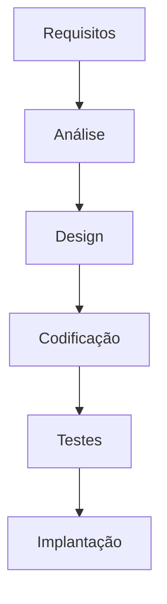

# 🚀 Agilidade no Desenvolvimento de Software

## 📚 Sumário
- [Introdução: Por que precisamos falar sobre Agilidade?](#introdução-por-que-precisamos-falar-sobre-agilidade)
- [O Jeito Antigo: O Modelo Cascata (Waterfall)](#o-jeito-antigo-o-modelo-cascata-waterfall)
- [A Revolução Ágil: O Manifesto que Mudou Tudo](#a-revolução-ágil-o-manifesto-que-mudou-tudo)
- [Gerenciando o Trabalho Ágil: Scrum e Kanban](#gerenciando-o-trabalho-ágil-scrum-e-kanban)
- [Construindo com Qualidade: Práticas Técnicas Ágeis](#construindo-com-qualidade-práticas-técnicas-ágeis)
- [Conclusão: Juntando as Peças](#conclusão-juntando-as-peças)
- [Glossário Rápido](#glossário-rápido)
- [Perguntas para Fixação](#perguntas-para-fixação)

## 🎯 Introdução: Por que precisamos falar sobre Agilidade?

### A Metáfora do Carro e da Caminhonete

Imagine que um cliente pede para você construir um carro. Você passa seis meses em planejamento detalhado: o motor V8, o design aerodinâmico, a cor vermelha Ferrari. Depois de mais seis meses de construção, você entrega uma obra de arte. Mas o cliente diz: 

> "Nossa, é incrível, mas nesse tempo eu me mudei para o campo, tive filhos e agora preciso de uma caminhonete 4x4 para levar a família e as compras."

Você entregou exatamente o que foi pedido no início, mas o produto final não serve mais. O problema não foi sua competência técnica, mas o processo. O mundo da tecnologia e as necessidades dos clientes mudam rápido demais.

> 💡 **Importante**: Agilidade não é sobre ser mais rápido, mas sobre ser mais adaptável. É sobre construir o produto em pequenas partes, mostrar para o cliente, obter feedback e ajustar o rumo constantemente.

## 🌊 O Jeito Antigo: O Modelo Cascata (Waterfall)

Antes da agilidade, o modelo mais comum era o Cascata. O nome já diz tudo: o trabalho flui como uma cachoeira, de cima para baixo, em fases rígidas.

### Como funciona?

O projeto passa por etapas sequenciais. Uma fase só começa quando a anterior está 100% concluída:



### Quais os problemas?

❌ **Rígido**: Mudar um requisito no meio do projeto é extremamente caro e difícil.

❌ **Lento**: O cliente só vê o produto funcionando no final, meses ou anos depois.

❌ **Arriscado**: E se, no final, o cliente não gostar? Ou se o mercado mudou e o software se tornou irrelevante?

## 📜 A Revolução Ágil: O Manifesto que Mudou Tudo

Em 2001, um grupo de desenvolvedores se cansou do modelo Cascata e criou o Manifesto para o Desenvolvimento Ágil de Software.

### Os 4 Valores Fundamentais

| Valorizamos mais... | Do que... |
|-------------------|-----------|
| 👥 **Indivíduos e interações** | Processos e ferramentas |
| 💻 **Software em funcionamento** | Documentação abrangente |
| 🤝 **Colaboração com o cliente** | Negociação de contratos |
| 🔄 **Responder a mudanças** | Seguir um plano |

> 💡 **Fique de Olho**: A agilidade valoriza mais os itens à esquerda, mas não significa que os itens à direita não tenham valor.

## 🎯 Gerenciando o Trabalho Ágil: Scrum e Kanban

### 💡 Exemplo Prático: Desenvolvimento de um App de Delivery

Vamos imaginar que estamos construindo um aplicativo de delivery de comida. Veja como seria a abordagem ágil:

**Product Backlog Inicial:**
```
- Usuários podem ver lista de restaurantes
- Usuários podem fazer pedidos
- Restaurantes podem aceitar/rejeitar pedidos
- Sistema de pagamento
- Rastreamento do entregador
- Sistema de avaliação
```

**Sprint 1 (MVP - Produto Mínimo Viável):**
- ✅ Lista básica de restaurantes
- ✅ Fazer pedido via WhatsApp
- ⏳ Confirmação manual por telefone

**Feedback do Cliente após Sprint 1:**
> "Ótimo! Mas os clientes estão pedindo para ver o cardápio dos restaurantes antes."

**Ajuste no Backlog:**
- 🔄 Adicionar cardápios digitais (nova prioridade)
- ⬇️ Sistema de rastreamento (menos prioritário agora)

Isto demonstra como a agilidade permite:
1. Entregar valor rapidamente (app funcionando em 2 semanas)
2. Adaptar baseado no feedback real
3. Priorizar o que realmente importa

### Scrum: Trabalhando em Ciclos de Valor

#### 👥 Papéis: Quem é quem no time?

- **Product Owner (PO)**: A "voz do cliente"
- **Scrum Master (SM)**: O "facilitador"
- **Time de Desenvolvimento**: Os construtores

#### 🕒 Eventos: O ritmo do Scrum

1. **Sprint Planning**: Planejamento inicial
2. **Daily Scrum**: Reunião diária (15 min)
3. **Sprint Review**: Apresentação dos resultados
4. **Sprint Retrospective**: Melhoria contínua

#### 📦 Artefatos: As ferramentas do Scrum

- **Product Backlog**: Lista completa de desejos
- **Sprint Backlog**: Compromisso do Sprint
- **Incremento**: Produto funcionando

### Kanban: O Poder do Fluxo Visual

#### 💡 Exemplo Prático: Suporte Técnico de TI

Veja como um time de suporte técnico usa Kanban:

```
┌──────────────┐ ┌──────────────┐ ┌──────────────┐ ┌──────────────┐
│   Backlog    │ │Em Atendimento│ │   Em Teste   │ │  Concluído   │
│   (Sem WIP)  │ │  (WIP: 3)    │ │  (WIP: 2)    │ │   (Sem WIP)  │
├──────────────┤ ├──────────────┤ ├──────────────┤ ├──────────────┤
│ #123         │ │ #119 - João  │ │ #117 - Maria │ │ #115         │
│ Erro de login│ │ Bug crítico  │ │ Nova feature │ │ Update SSL   │
├──────────────┤ ├──────────────┤ ├──────────────┤ ├──────────────┤
│ #122         │ │ #118 - Ana   │ │ #116 - Pedro │ │ #114         │
│ Lentidão     │ │ Backup falha │ │ Migração BD  │ │ Fix cache    │
└──────────────┘ └──────────────┘ └──────────────┘ └──────────────┘
```

**Benefícios Observados:**
- Visualização clara do trabalho em andamento
- Identificação rápida de gargalos
- Previsibilidade de entrega
- Distribuição equilibrada de trabalho

#### Os 3 Princípios do Kanban

1. 👀 **Visualizar o Trabalho**
2. ⚖️ **Limitar o Trabalho em Progresso (WIP)**
3. 🔄 **Gerenciar o Fluxo**

### Scrum vs. Kanban: Qual usar?

| Característica | Scrum | Kanban |
|---------------|-------|---------|
| Ritmo | 🔄 Ciclos fixos | ⏳ Fluxo contínuo |
| Entregas | 📦 Ao final do Sprint | 🚀 A qualquer momento |
| Métricas | 📊 Velocidade | ⚡ Tempo de ciclo |
| Papéis | 👥 Formais | 🤝 Flexíveis |

## 🛠 Construindo com Qualidade: Práticas Técnicas Ágeis

### XP (Extreme Programming)

#### 👥 Pair Programming

- **Piloto (Driver)**: No teclado
- **Navegador (Navigator)**: Estratégia e revisão

#### 🧪 TDD (Test-Driven Development)

##### 💡 Exemplo Prático: Calculadora de IMC

Vamos ver como seria desenvolver uma função de cálculo de IMC usando TDD:

1. 🔴 **VERMELHO**: Primeiro, escrevemos o teste
```javascript
test('Calcula IMC corretamente', () => {
    expect(calcularIMC(70, 1.75)).toBe(22.9);
    expect(calcularIMC(85, 1.80)).toBe(26.2);
});
```

2. 🟢 **VERDE**: Implementamos o mínimo para passar
```javascript
function calcularIMC(peso, altura) {
    return Number((peso / (altura * altura)).toFixed(1));
}
```

3. 🔵 **REFATORAR**: Melhoramos o código mantendo os testes passando
```javascript
function calcularIMC(peso, altura) {
    if (peso <= 0 || altura <= 0) {
        throw new Error('Valores devem ser positivos');
    }
    const imc = peso / Math.pow(altura, 2);
    return Number(imc.toFixed(1));
}
```

**Benefícios Demonstrados:**
- Código nasce testado
- Documentação viva através dos testes
- Confiança para refatorar
- Design mais limpo e focado

## 🎯 Conclusão: Juntando as Peças

> Ser ágil é uma mentalidade que une gestão eficiente e excelência técnica.

## 📚 Glossário Rápido

- **Sprint**: Ciclo de trabalho (1-4 semanas)
- **Backlog**: Lista de tarefas
- **WIP**: Trabalho em Progresso
- **Stakeholder**: Interessados no projeto
- **Incremento**: Software funcionando
- **Refatoração**: Melhorar sem mudar comportamento

## ❓ Perguntas para Fixação

1. Qual o principal problema do modelo Cascata que a Agilidade resolve?
2. Dos 4 valores do Manifesto Ágil, qual é mais impactante para você?
3. Como um Scrum Master difere de um gerente tradicional?
4. Por que limitar o WIP é importante no Kanban?
5. Descreva o ciclo TDD para calcular a área de um retângulo.

---
*Lembre-se: A agilidade é uma jornada, não um destino. Continue aprendendo e adaptando!* 🚀
