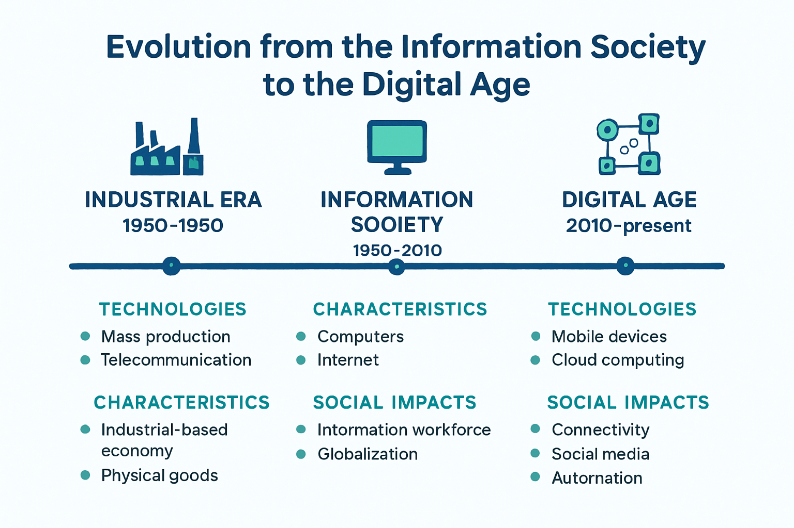

# Módulo 1: Fundamentos da Tecnologia e Sociedade

## Unidade 1.1: Sociedade Informática e a Era Digital

A tecnologia, em sua essência, é a aplicação do conhecimento científico para fins práticos, visando resolver problemas e melhorar a qualidade de vida. Ao longo da história, a evolução tecnológica tem sido um motor fundamental para as transformações sociais, econômicas e culturais. Desde a invenção da roda até a revolução digital, cada avanço tecnológico redefiniu as interações humanas e a organização da sociedade.

### Conceitos de Tecnologia e Sociedade

A relação entre tecnologia e sociedade é intrínseca e bidirecional. A tecnologia não é apenas uma ferramenta neutra; ela molda e é moldada pelas sociedades em que surge e se desenvolve. Essa interação complexa pode ser analisada sob diversas perspectivas:

*   **Determinismo Tecnológico:** Uma visão que sugere que a tecnologia é a principal força motriz das mudanças sociais, determinando a estrutura e o funcionamento da sociedade. Embora essa perspectiva seja simplista, ela destaca o poder transformador da tecnologia.
*   **Construção Social da Tecnologia:** Em contraste, essa visão argumenta que a tecnologia é um produto das escolhas humanas e das condições sociais, culturais e econômicas. A sociedade, através de suas necessidades, valores e conflitos, influencia o design, o desenvolvimento e a adoção de tecnologias.
*   **Coevolução:** Uma abordagem mais equilibrada que reconhece a interdependência entre tecnologia e sociedade, onde ambas se influenciam e se desenvolvem mutuamente em um processo contínuo de adaptação e transformação.

No contexto atual, a tecnologia é um fator crucial no desenvolvimento da sociedade, moldando a forma como vivemos, trabalhamos e nos comunicamos [1]. Ela traz inúmeras vantagens, como a facilidade na comunicação, melhorias em diversas áreas (educação, saúde, indústria) e o avanço do conhecimento. No entanto, também apresenta desafios, como o impacto no comportamento humano, a diminuição de postos de trabalho em alguns setores e a necessidade de reflexão sobre o tecnocentrismo [1].

### Impactos da Tecnologia no Comportamento Humano e nas Relações Sociais

O advento de tecnologias como a internet, os smartphones e as redes sociais transformou radicalmente o comportamento humano e as relações sociais. A conectividade constante e o acesso instantâneo à informação alteraram a forma como nos comunicamos, aprendemos, trabalhamos e nos divertimos. Alguns dos impactos mais notáveis incluem:

*   **Comunicação:** A tecnologia facilitou a comunicação global e instantânea, permitindo que pessoas se conectem independentemente da distância geográfica. No entanto, também levantou preocupações sobre a qualidade das interações, a superficialidade das relações e o isolamento social em alguns casos.
*   **Educação:** A tecnologia democratizou o acesso ao conhecimento, com plataformas de ensino a distância, recursos educacionais abertos e ferramentas interativas. Isso transformou os métodos de ensino e aprendizagem, mas também exige novas habilidades de letramento digital.
*   **Trabalho:** A automação e a digitalização de processos impactaram o mercado de trabalho, criando novas profissões e exigindo novas competências. A tecnologia pode ser utilizada para diminuir postos de trabalho no sistema capitalista, o que levanta questões sobre a requalificação profissional e a distribuição de renda [1].
*   **Cultura e Entretenimento:** O consumo de conteúdo cultural e de entretenimento foi revolucionado pela tecnologia, com plataformas de streaming, jogos online e mídias sociais. Isso gerou novas formas de expressão artística e cultural, mas também desafios relacionados à pirataria e à concentração de poder em grandes corporações.
*   **Saúde:** A tecnologia tem impulsionado avanços significativos na medicina, desde diagnósticos mais precisos até tratamentos inovadores e telemedicina. No entanto, também levanta questões éticas e de privacidade relacionadas aos dados de saúde.

### A Evolução da Sociedade da Informação para a Era Digital

A transição da sociedade industrial para a **Sociedade da Informação** foi marcada pela centralidade da informação como principal recurso econômico e social. Nesse período, o foco estava na produção, processamento e distribuição de informações. A proliferação de computadores pessoais, a internet discada e o surgimento de grandes bancos de dados foram marcos dessa fase.

Atualmente, estamos imersos na **Era Digital**, que vai além da simples posse e acesso à informação. A Era Digital é caracterizada pela ubiquidade da tecnologia, pela interconexão em rede, pela capacidade de processar grandes volumes de dados (Big Data) e pela emergência de tecnologias disruptivas como a Inteligência Artificial, a Internet das Coisas e o Blockchain. Nessa era, a capacidade de imaginar e criar novas realidades e soluções inovadoras supera a simples coleta e processamento de informações [2].

Estudos de Ciência, Tecnologia e Sociedade (CTS) entendem que ciência e tecnologia são atividades sociais, situadas no tempo, espaço e cultura [1]. Isso significa que a tecnologia não é um fenômeno isolado, mas sim parte integrante do tecido social, influenciando e sendo influenciada por valores, crenças e estruturas sociais.

O impacto social da tecnologia na sociedade é vasto, abrangendo áreas como educação, comunicação, trabalho e processos produtivos [1]. Compreender essa dinâmica é fundamental para os profissionais de TI, que atuam na vanguarda dessas transformações e têm a responsabilidade de desenvolver e aplicar tecnologias de forma ética e socialmente responsável.

**Referências:**

[1] Autentify. O impacto da tecnologia na sociedade e nas relações humanas. Disponível em: [https://www.autentify.com.br/marketing/tecnologia-e-sociedade-o-impacto-da-tecnologia-na-sociedade-e-nas-relacoes-humanas/](https://www.autentify.com.br/marketing/tecnologia-e-sociedade-o-impacto-da-tecnologia-na-sociedade-e-nas-relacoes-humanas/)

[2] Instagram. A transição da “Era da Informação” para a “Era da Imaginação” é... Disponível em: [https://www.instagram.com/p/C-sB8y7xBMl/?hl=am-et](https://www.instagram.com/p/C-sB8y7xBMl/?hl=am-et)

### Questões de Fixação - Unidade 1.1

**1. Qual das seguintes opções melhor descreve a relação entre tecnologia e sociedade?**

a) A tecnologia é uma força autônoma que determina o curso da sociedade.

b) A sociedade cria e molda a tecnologia de acordo com suas necessidades e valores.

c) A tecnologia e a sociedade se influenciam e coevoluem mutuamente.

d) A tecnologia é uma ferramenta neutra, sem impacto significativo nas relações sociais.

Resposta

c) A tecnologia e a sociedade se influenciam e coevoluem mutuamente.

**2. O que caracteriza a "Era Digital" em contraste com a "Sociedade da Informação"?**

a) O foco principal na produção e distribuição de informações.
b) A ubiquidade da tecnologia, a interconexão em rede e o surgimento de tecnologias disruptivas.
c) O uso de computadores pessoais e internet discada.
d) A centralidade da informação como principal recurso econômico.

Resposta

b) A ubiquidade da tecnologia, a interconexão em rede e o surgimento de tecnologias disruptivas.

## Unidade 1.2: Transição da Informação e Transformação Digital

A evolução tecnológica e a crescente digitalização de processos e informações têm impulsionado mudanças significativas na forma como as organizações operam e interagem com o mundo. Nesse contexto, a "Transição da Informação" e a "Transformação Digital" são conceitos-chave que descrevem essa jornada de adaptação e inovação.

### Conceito de Transição de Dados e Serviços de TI

No âmbito da Tecnologia da Informação, a **Transição da Informação** pode ser compreendida sob diferentes perspectivas, todas elas relacionadas ao movimento e à gestão de dados e serviços:

*   **Transição de Dados:** Refere-se ao processo de mover dados de um sistema, formato ou ambiente para outro [3]. Isso é fundamental em diversas áreas, como migração de sistemas legados para novas plataformas, consolidação de bancos de dados ou integração de informações entre diferentes aplicações. A transformação de dados, que envolve a conversão de informações de um formato para outro, tornando-as mais acessíveis e úteis, é um componente crítico desse processo [3].
*   **Transição de Serviços de TI:** Diz respeito à gestão de mudanças em rotinas de TI, infraestrutura de equipamentos e serviços. O objetivo é garantir que novos ou alterados serviços de TI sejam entregues de forma eficiente e eficaz, minimizando interrupções e riscos. Isso inclui a implementação de novos sistemas, a atualização de infraestruturas ou a adoção de novas práticas operacionais [3].
*   **Transição de Carreira para a Área de Dados/TI:** Em um sentido mais amplo, a transição da informação também se manifesta no mercado de trabalho, com o movimento de profissionais de outras áreas para o setor de tecnologia da informação, especialmente para funções relacionadas a dados e engenharia de dados. Essa transição reflete a crescente demanda por especialistas capazes de gerenciar e extrair valor de grandes volumes de informações [3].

### A Jornada da Transformação Digital nas Organizações

A **Transformação Digital** é um processo contínuo e abrangente que envolve a integração de tecnologias digitais em todas as áreas de uma empresa, mudando fundamentalmente a forma como ela opera e entrega valor aos clientes. Não se trata apenas de adotar novas tecnologias, mas de uma mudança cultural que exige que as organizações desafiem o status quo, experimentem e se sintam confortáveis com a falha.

**Pilares da Transformação Digital:**

1.  **Experiência do Cliente:** A transformação digital visa melhorar a jornada do cliente, oferecendo experiências personalizadas, convenientes e eficientes através de canais digitais.
2.  **Processos Operacionais:** A digitalização otimiza processos internos, tornando-os mais eficientes, automatizados e ágeis. Isso pode incluir a automação de tarefas repetitivas, a digitalização de documentos e a implementação de sistemas integrados [3].
3.  **Modelos de Negócio:** A transformação digital pode levar à criação de novos produtos, serviços e até mesmo modelos de negócio inteiramente novos, impulsionados pela tecnologia.
4.  **Cultura Organizacional:** A mudança cultural é um dos aspectos mais desafiadores da transformação digital. Ela exige uma mentalidade de inovação, colaboração e aprendizado contínuo por parte de todos os colaboradores.

### Desafios e Oportunidades da Gestão da Informação na Era Digital

A era digital trouxe consigo uma explosão de dados, tornando a gestão da informação mais complexa e, ao mesmo tempo, mais estratégica. As organizações enfrentam diversos desafios e oportunidades:

**Desafios:**

*   **Volume, Velocidade e Variedade (Big Data):** Lidar com o imenso volume de dados gerados em alta velocidade e em diversos formatos é um desafio técnico e gerencial.
*   **Qualidade dos Dados:** Garantir a precisão, consistência e confiabilidade dos dados é crucial para a tomada de decisões.
*   **Segurança e Privacidade:** Proteger os dados contra acessos não autorizados, vazamentos e ataques cibernéticos é uma preocupação constante, especialmente com a LGPD e outras regulamentações de privacidade [3].
*   **Fragmentação dos Dados:** Um dos principais desafios da transição digital é a fragmentação dos dados entre diferentes sistemas e departamentos, o que dificulta uma visão unificada e a análise integrada [3].
*   **Cultura e Habilidades:** A falta de profissionais com perfil e qualificação em tecnologia da informação (TI) é uma dificuldade enfrentada pelas empresas, que precisam investir em capacitação e atração de talentos [3].

**Oportunidades:**

*   **Tomada de Decisão Baseada em Dados:** A análise de dados permite insights valiosos para a tomada de decisões estratégicas, otimização de processos e identificação de novas oportunidades de negócio.
*   **Personalização e Inovação:** A gestão eficaz da informação possibilita a personalização de produtos e serviços, além de impulsionar a inovação e o desenvolvimento de novas soluções.
*   **Eficiência Operacional:** Ferramentas digitais agilizam a gestão da informação, otimizando processos operacionais e tornando-os mais eficientes [3].
*   **Vantagem Competitiva:** Empresas que conseguem gerenciar e utilizar a informação de forma estratégica obtêm uma vantagem competitiva significativa no mercado.

A transição para o ambiente digital e a gestão eficaz da informação são, portanto, elementos cruciais para a sobrevivência e o sucesso das organizações na era atual. A Governança de Dados, por exemplo, torna-se um pilar essencial da transição digital, garantindo que os dados sejam tratados como um ativo estratégico [3].

**Referências:**

[3] Profissão Cloud. O que é Transição - Tecnologia da Informação. Disponível em: [https://profissaocloud.com.br/glossario/o-que-e-transicao-tecnologia-da-informacao/](https://profissaocloud.com.br/glossario/o-que-e-transicao-tecnologia-da-informacao/)

### Questões de Fixação - Unidade 1.2

**1. Qual dos seguintes não é considerado um pilar da Transformação Digital?**

a) Experiência do Cliente
b) Processos Operacionais
c) Modelos de Negócio
d) Hierarquia Organizacional

Resposta

d) Hierarquia Organizacional

**2. Qual é um dos principais desafios da gestão da informação na era digital?**

a) A falta de dados para análise.
b) A fragmentação dos dados entre diferentes sistemas.
c) A simplicidade dos processos de negócio.
d) A baixa velocidade de geração de dados.

Resposta

b) A fragmentação dos dados entre diferentes sistemas.

## Unidade 1.3: Cenários e Tecnologias da Informação

A Tecnologia da Informação (TI) é um campo vasto e em constante evolução, que abrange um conjunto de recursos, ferramentas e soluções tecnológicas utilizadas para criar, processar, armazenar, recuperar, trocar e gerenciar dados e informações. Ela permeia todos os aspectos da computação em uma organização, desde o estudo e conceitualização até o desenvolvimento, execução e suporte de sistemas de informação [4].

### Panorama Atual do Mercado de TI

O mercado de TI é um dos mais dinâmicos e estratégicos da economia global. Caracteriza-se por um crescimento acelerado, impulsionado pela digitalização de todos os setores e pela crescente dependência das organizações em relação à tecnologia. Algumas das características e tendências que moldam o cenário atual incluem:

*   **Crescimento Contínuo:** A demanda por soluções e profissionais de TI permanece alta, com projeções de crescimento para os próximos anos [5].
*   **Escassez de Talentos:** Apesar do crescimento, há uma lacuna significativa entre a demanda e a oferta de profissionais qualificados em diversas áreas da TI, o que gera um desafio para as empresas [4].
*   **Investimento em Transformação Digital:** Empresas de todos os portes estão investindo pesadamente em tecnologias digitais para otimizar processos, melhorar a experiência do cliente e criar novos modelos de negócios [4].
*   **Globalização:** O mercado de TI é globalizado, com oportunidades de trabalho remoto e colaboração internacional.

### Principais Tendências Tecnológicas

As tendências tecnológicas são os motores da inovação no mercado de TI. Compreender essas tendências é fundamental para profissionais e organizações se manterem relevantes e competitivos. As principais incluem:

*   **Inteligência Artificial (IA) e Machine Learning (ML):** A IA continua a ser uma das áreas mais promissoras. A **IA Generativa**, capaz de criar novos conteúdos (textos, imagens, músicas), e a **IA Multimodal**, que combina diferentes tipos de dados para uma compreensão mais completa, são destaques. Os **Agentes de IA**, sistemas autônomos que realizam tarefas complexas, também estão ganhando força [6].
*   **Computação em Nuvem (Cloud Computing):** A adoção da nuvem continua crescendo, oferecendo escalabilidade, flexibilidade e redução de custos. Há um foco crescente em **ambientes híbridos e multicloud**, que combinam nuvens públicas e privadas para otimizar custos, desempenho e segurança [6].
*   **Big Data e Análise de Dados:** A capacidade de coletar, armazenar e analisar grandes volumes de dados se tornou crucial para a tomada de decisões estratégicas. Ferramentas avançadas de análise e visualização de dados são cada vez mais importantes [4].
*   **Cibersegurança:** Com o aumento das ameaças cibernéticas, a segurança da informação é uma prioridade máxima. Novas abordagens, como a **segurança baseada em IA** e a **segurança contra desinformação**, são essenciais para proteger dados e sistemas [4, 6].
*   **Internet das Coisas (IoT):** A interconexão de dispositivos e objetos físicos permite a coleta de dados em tempo real e a criação de ambientes inteligentes, desde casas conectadas até cidades inteligentes e processos industriais otimizados [4, 6].
*   **Desenvolvimento Ágil e DevOps:** Metodologias ágeis como Scrum e a cultura DevOps são cada vez mais adotadas para acelerar o desenvolvimento e a entrega de software, promovendo a colaboração entre equipes de desenvolvimento e operações [4].
*   **Realidade Aumentada (RA) e Realidade Virtual (RV):** A RA e a RV estão se expandindo para além do entretenimento, com aplicações em treinamento, simulação, design de produtos e experiências imersivas [6].
*   **Blockchain:** Além das criptomoedas, o blockchain está sendo explorado para aplicações em logística, cadeia de suprimentos, votação eletrônica e outras áreas que exigem transparência e segurança [6].
*   **Desenvolvimento Low-Code e No-Code:** Plataformas que permitem a criação de aplicações com pouca ou nenhuma codificação, acelerando o desenvolvimento e democratizando o acesso à criação de software [6].
*   **Sustentabilidade na TI:** A preocupação com o impacto ambiental da tecnologia impulsiona a busca por soluções mais eficientes em termos de energia e a adoção de práticas de TI Verde [6].

### O Papel Estratégico da TI nas Organizações

A TI deixou de ser apenas um departamento de suporte técnico para se tornar um parceiro estratégico fundamental para o sucesso das organizações. Seu papel estratégico se manifesta em diversas áreas:

*   **Alinhamento com o Negócio:** A TI deve estar alinhada com os objetivos e as estratégias de negócio, garantindo que as soluções tecnológicas contribuam para o crescimento e a competitividade da empresa.
*   **Inovação e Vantagem Competitiva:** A TI é um motor de inovação, permitindo a criação de novos produtos, serviços e modelos de negócio que podem gerar uma vantagem competitiva significativa.
*   **Eficiência Operacional:** A automação de processos, a otimização de fluxos de trabalho e a análise de dados contribuem para a redução de custos e o aumento da eficiência operacional.
*   **Tomada de Decisão:** A TI fornece as ferramentas e os dados necessários para uma tomada de decisão mais informada e estratégica em todos os níveis da organização.
*   **Gestão de Riscos:** A TI desempenha um papel crucial na gestão de riscos, especialmente em relação à segurança da informação, à continuidade dos negócios e à conformidade com regulamentações.

Compreender os cenários e as tecnologias da informação é, portanto, essencial para os profissionais de TI, que precisam estar constantemente atualizados e preparados para atuar de forma estratégica e inovadora, contribuindo para o sucesso das organizações em um ambiente cada vez mais digital e competitivo.

**Referências:**

[4] TOTVS. O que é TI (Tecnologia da Informação)? Guia Completo. Disponível em: [https://www.totvs.com/blog/gestao-de-ti/o-que-e-ti/](https://www.totvs.com/blog/gestao-de-ti/o-que-e-ti/)

[5] G1. Mercado de TI deve crescer 12% em 2023 e tem vagas sobrando. Disponível em: [https://g1.globo.com/sp/sao-paulo/especial-publicitario/huawei/brasil-mais-digital/noticia/2023/05/17/mercado-de-ti-deve-crescer-12-em-2023-e-tem-vagas-sobrando.ghtml](https://g1.globo.com/sp/sao-paulo/especial-publicitario/huawei/brasil-mais-digital/noticia/2023/05/17/mercado-de-ti-deve-crescer-12-em-2023-e-tem-vagas-sobrando.ghtml)

[6] Canaltech. 10 principais tendências de tecnologia para 2023. Disponível em: [https://canaltech.com.br/inovacao/10-principais-tendencias-de-tecnologia-para-2023-231005/](https://canaltech.com.br/inovacao/10-principais-tendencias-de-tecnologia-para-2023-231005/)

### Questões de Fixação

**1. Qual das seguintes opções melhor descreve a relação entre tecnologia e sociedade?**

a) A tecnologia é uma força autônoma que determina o curso da sociedade.
b) A sociedade cria e molda a tecnologia de acordo com suas necessidades e valores.
c) A tecnologia e a sociedade se influenciam e coevoluem mutuamente.
d) A tecnologia é uma ferramenta neutra, sem impacto significativo nas relações sociais.

Resposta

c) A tecnologia e a sociedade se influenciam e coevoluem mutuamente.

**2. O que caracteriza a "Era Digital" em contraste com a "Sociedade da Informação"?**

a) O foco principal na produção e distribuição de informações.
b) A ubiquidade da tecnologia, a interconexão em rede e o surgimento de tecnologias disruptivas.
c) O uso de computadores pessoais e internet discada.
d) A centralidade da informação como principal recurso econômico.

Resposta

b) A ubiquidade da tecnologia, a interconexão em rede e o surgimento de tecnologias disruptivas.

**3. Qual dos seguintes não é considerado um pilar da Transformação Digital?**

a) Experiência do Cliente
b) Processos Operacionais
c) Modelos de Negócio
d) Hierarquia Organizacional

Resposta

d) Hierarquia Organizacional

### Questões de Fixação - Unidade 1.3

**1. Qual das seguintes tendências tecnológicas é caracterizada pela capacidade de criar novos conteúdos (textos, imagens, músicas)?**

a) Computação em Nuvem
b) Internet das Coisas (IoT)
c) Inteligência Artificial Generativa
d) Cibersegurança

Resposta

c) Inteligência Artificial Generativa

**2. A escassez de talentos no mercado de TI se refere a:**

a) A falta de investimento em novas tecnologias.
b) A dificuldade em encontrar profissionais qualificados para as vagas existentes.
c) A baixa demanda por profissionais de TI.
d) A alta rotatividade de funcionários no setor.

Resposta

b) A dificuldade em encontrar profissionais qualificados para as vagas existentes.

