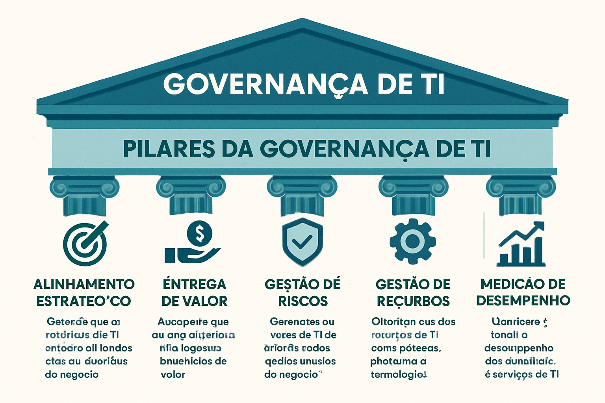

# Módulo 2: Governança de TI: Conceitos e Princípios

## Unidade 2.1: Conceitos de Governança e Governança de TI

A Governança de TI (GovTI) é um componente essencial da Governança Corporativa, que visa garantir que a Tecnologia da Informação (TI) seja utilizada de forma eficaz, eficiente e alinhada aos objetivos estratégicos da organização. Para compreender a GovTI, é fundamental primeiro entender o conceito mais amplo de Governança Corporativa.

### Definição de Governança Corporativa

A **Governança Corporativa** é o sistema pelo qual as empresas e outras organizações são dirigidas, monitoradas e incentivadas, envolvendo os relacionamentos entre sócios, conselho de administração, diretoria, órgãos de fiscalização e controle e demais partes interessadas (stakeholders) [7]. Seu principal objetivo é assegurar a conformidade, a transparência, a equidade e a responsabilidade na gestão da organização, visando a sustentabilidade e a geração de valor a longo prazo.

Os princípios básicos da Governança Corporativa, segundo o Instituto Brasileiro de Governança Corporativa (IBGC), são [7]:

*   **Transparência:** Disponibilizar informações claras, precisas e tempestivas para todas as partes interessadas.
*   **Equidade:** Tratar todos os sócios e demais partes interessadas de forma justa e isonômica.
*   **Prestação de Contas (Accountability):** Os agentes de governança devem prestar contas de sua atuação de modo claro, conciso, compreensível e tempestivo, assumindo integralmente as consequências de seus atos e omissões.
*   **Responsabilidade Corporativa:** Zelar pela viabilidade econômico-financeira das organizações, reduzir as externalidades negativas de seus negócios e suas operações e aumentar as positivas, levando em consideração, no seu modelo de negócios, os diversos capitais (financeiro, manufaturado, intelectual, humano, social, ambiental, reputacional, etc.) no curto, médio e longo prazos.

### Definição e Importância da Governança de TI (GovTI)

A **Governança de TI (GovTI)** é uma extensão da Governança Corporativa, focada especificamente na área de Tecnologia da Informação. Ela pode ser definida como a estrutura de relacionamentos e processos para dirigir e controlar a TI a fim de atingir os objetivos da organização, agregando valor ao negócio e equilibrando os riscos versus o retorno sobre os investimentos em TI [8].

Em outras palavras, a GovTI busca garantir que a TI não seja apenas um centro de custos ou um departamento de suporte técnico, mas sim um parceiro estratégico que contribui ativamente para o sucesso do negócio. A importância da GovTI reside em sua capacidade de [8, 9]:

*   **Alinhar a TI à Estratégia do Negócio:** Garantir que os investimentos e as iniciativas de TI estejam alinhados com os objetivos estratégicos da empresa, evitando o desperdício de recursos em projetos que não agregam valor.
*   **Otimizar a Entrega de Valor:** Assegurar que a TI entregue os benefícios prometidos, em termos de eficiência, inovação e vantagem competitiva, com um retorno sobre o investimento (ROI) positivo.
*   **Gerenciar Riscos:** Identificar, avaliar e mitigar os riscos associados ao uso da TI, como riscos de segurança, operacionais, de conformidade e de reputação.
*   **Otimizar o Uso de Recursos:** Garantir que os recursos de TI (humanos, financeiros, tecnológicos) sejam utilizados de forma eficiente e eficaz, maximizando seu potencial.
*   **Medir o Desempenho:** Estabelecer métricas e indicadores para monitorar o desempenho da TI e garantir que ela esteja atendendo às expectativas do negócio.

### Os 5 Pilares da Governança de TI

A Governança de TI é sustentada por cinco pilares fundamentais, que representam as áreas de foco para uma gestão eficaz da tecnologia [9]:

1.  **Alinhamento Estratégico:** Este pilar busca garantir que a TI esteja em sintonia com a estratégia de negócio da organização. Isso envolve a compreensão dos objetivos de negócio e a tradução desses objetivos em estratégias e planos de TI. O alinhamento estratégico é a base para que a TI possa agregar valor real ao negócio.
2.  **Entrega de Valor:** O objetivo deste pilar é garantir que a TI entregue os benefícios prometidos, otimizando os custos e provando o valor intrínseco da tecnologia. Isso envolve a gestão de projetos, a entrega de serviços de qualidade e a medição do retorno sobre os investimentos em TI.
3.  **Gestão de Riscos:** Este pilar foca na identificação, avaliação e mitigação dos riscos relacionados à TI. Isso inclui riscos de segurança da informação, riscos operacionais (falhas de sistemas, indisponibilidade), riscos de conformidade (não cumprimento de leis e regulamentos) e riscos de reputação. Uma gestão de riscos eficaz protege os ativos da organização e garante a continuidade dos negócios.
4.  **Gestão de Recursos:** Este pilar trata da otimização e do gerenciamento dos recursos de TI, incluindo pessoas, infraestrutura, aplicações e informações. O objetivo é garantir que os recursos sejam utilizados de forma eficiente e eficaz para atender às necessidades do negócio.
5.  **Medição de Desempenho:** Este pilar envolve o monitoramento e a avaliação do desempenho da TI, utilizando métricas e indicadores para rastrear a performance dos processos, projetos e serviços. A medição de desempenho é fundamental para garantir que a TI esteja cumprindo suas metas e para identificar oportunidades de melhoria.

Ao abordar esses cinco pilares de forma integrada, as organizações podem estabelecer uma Governança de TI robusta, que transforma a TI em um ativo estratégico e um diferencial competitivo.

**Referências:**

[7] IBGC. O que é Governança Corporativa. Disponível em: [https://www.ibgc.org.br/conheca/o-que-e-governanca](https://www.ibgc.org.br/conheca/o-que-e-governanca)

[8] IT Governance Institute. IT Governance. Disponível em: [https://www.itgi.org/](https://www.itgi.org/)

[9] G2. O que é Governança de TI? Disponível em: [https://www.g2.com/pt-BR/glossario/governanca-de-ti-definicao](https://www.g2.com/pt-BR/glossario/governanca-de-ti-definicao)

### Questões de Múltipla Escolha - Unidade 2.1

**1. Qual dos seguintes não é um princípio fundamental da Governança Corporativa, segundo o IBGC?**

a) Transparência
b) Equidade
c) Inovação
d) Prestação de Contas (Accountability)

Resposta

c) Inovação

**2. Qual o principal objetivo da Governança de TI (GovTI)?**

a) Reduzir os custos de TI a qualquer custo.
b) Garantir que a TI seja utilizada de forma eficaz, eficiente e alinhada aos objetivos estratégicos da organização.
c) Apenas gerenciar a infraestrutura de hardware e software.
d) Desenvolver novas tecnologias para a organização.

Resposta

b) Garantir que a TI seja utilizada de forma eficaz, eficiente e alinhada aos objetivos estratégicos da organização.

## Unidade 2.2: Princípios para Implantação de uma Governança de TI

A implementação de uma Governança de TI eficaz requer a adoção de princípios sólidos que orientem as decisões e as ações da organização. A norma internacional **ISO/IEC 38500** é uma referência fundamental nesse sentido, fornecendo um framework de princípios para a governança de TI que pode ser aplicado a organizações de todos os portes e tipos.

### A Norma ISO/IEC 38500

A ISO/IEC 38500, intitulada "Tecnologia da Informação — Governança de TI para a organização", foi publicada em 2008 e revisada em 2015. Ela fornece um framework de princípios para a governança de TI, aplicável a organizações de todos os portes e tipos, tanto do setor público quanto do privado. A norma não prescreve mecanismos ou processos específicos, mas sim um conjunto de princípios que devem ser considerados pelos responsáveis pela governança da organização (conselho de administração, diretores, etc.) ao avaliar, dirigir e monitorar o uso da TI [10, 11].

O principal objetivo da ISO/IEC 38500 é promover o uso eficaz, eficiente e aceitável da TI, garantindo que a tecnologia contribua positivamente para o desempenho da organização. Ela se baseia em seis princípios fundamentais, que devem ser aplicados em três tarefas principais de governança: Avaliar, Dirigir e Monitorar [10, 11].

### Os 6 Princípios da ISO/IEC 38500

Os seis princípios da ISO/IEC 38500 são [10, 11]:

1.  **Responsabilidade (Responsibility):** Os indivíduos e grupos dentro da organização devem compreender e aceitar suas responsabilidades em relação ao fornecimento e à demanda de TI. As responsabilidades pela governança de TI devem ser claramente definidas e atribuídas. Isso garante que haja prestação de contas (accountability) e que as decisões sejam tomadas por quem tem a autoridade e o conhecimento necessários.
2.  **Estratégia (Strategy):** A estratégia de negócio da organização deve levar em consideração as capacidades atuais e futuras da TI. Os planos estratégicos de TI devem satisfazer as necessidades atuais e futuras da estratégia de negócio. Isso garante o alinhamento estratégico entre TI e negócio, um dos pilares da GovTI.
3.  **Aquisição (Acquisition):** As aquisições de TI devem ser feitas por razões válidas, com base em uma análise apropriada e contínua, com tomada de decisão clara e transparente. Deve haver um equilíbrio adequado entre benefícios, oportunidades, custos e riscos, tanto a curto quanto a longo prazo. Isso garante que os investimentos em TI sejam justificados e gerem valor para a organização.
4.  **Desempenho (Performance):** A TI deve ser adequada ao seu propósito de apoiar a organização, fornecendo os serviços com a qualidade necessária para atender às necessidades atuais e futuras do negócio. O desempenho da TI deve ser monitorado e medido para garantir que ela esteja cumprindo suas metas e contribuindo para a eficiência e a eficácia da organização.
5.  **Conformidade (Conformance):** A TI deve estar em conformidade com todas as leis, regulamentos e políticas aplicáveis. As políticas e práticas de TI devem ser claramente definidas, implementadas e aplicadas. Isso garante que a organização opere de forma legal e ética, mitigando os riscos de não conformidade.
6.  **Comportamento Humano (Human Behaviour):** As políticas, práticas e decisões de TI devem respeitar o comportamento humano, incluindo as necessidades atuais e futuras de todas as pessoas envolvidas no processo. A TI deve ser projetada para ser fácil de usar e para apoiar as atividades dos usuários, promovendo uma cultura de colaboração e engajamento.

### As 3 Tarefas da Governança de TI (Avaliar, Dirigir, Monitorar)

A ISO/IEC 38500 propõe que os responsáveis pela governança apliquem os seis princípios acima em três tarefas principais [10, 11]:

1.  **Avaliar (Evaluate):** Avaliar continuamente o uso atual e futuro da TI, considerando as estratégias, políticas e o desempenho da organização. Isso envolve analisar o ambiente interno e externo, identificar oportunidades e riscos, e avaliar a eficácia da TI em relação aos objetivos de negócio.
2.  **Dirigir (Direct):** Direcionar a preparação e a implementação de planos e políticas de TI. Isso inclui a definição de estratégias, a alocação de recursos, a aprovação de investimentos e a comunicação das diretrizes de TI para toda a organização.
3.  **Monitorar (Monitor):** Monitorar a conformidade com as políticas e o desempenho em relação aos planos. Isso envolve o acompanhamento de métricas e indicadores, a realização de auditorias e a avaliação dos resultados dos investimentos em TI, garantindo que a TI esteja entregando o valor esperado.

Ao adotar os princípios e as tarefas da ISO/IEC 38500, as organizações podem estabelecer um ciclo virtuoso de governança de TI, onde a avaliação contínua leva a um direcionamento mais eficaz, que por sua vez é monitorado para garantir o desempenho e a conformidade, gerando novas informações para a próxima avaliação. Isso cria uma base sólida para uma Governança de TI madura e alinhada aos objetivos de negócio.

**Referências:**

[10] ISO. ISO/IEC 38500:2015 - Information technology — Governance of IT for the organization. Disponível em: [https://www.iso.org/standard/62816.html](https://www.iso.org/standard/62816.html)

[11] Portal ISO. ISO 38500 – Governança de TI. Disponível em: [https://portaliso.com/iso-38500-governanca-de-ti/](https://portaliso.com/iso-38500-governanca-de-ti/)

### Questões de Múltipla Escolha - Unidade 2.2

**1. Qual o principal objetivo da norma ISO/IEC 38500?**

a) Prescrever mecanismos e processos específicos para a Governança de TI.
b) Promover o uso eficaz, eficiente e aceitável da TI, garantindo que a tecnologia contribua positivamente para o desempenho da organização.
c) Definir os níveis de maturidade dos processos de TI.
d) Focar exclusivamente na gestão de serviços de TI.

Resposta

b) Promover o uso eficaz, eficiente e aceitável da TI, garantindo que a tecnologia contribua positivamente para o desempenho da organização.

**2. Qual dos princípios da ISO/IEC 38500 garante que a TI deve estar em conformidade com todas as leis, regulamentos e políticas aplicáveis?**

a) Responsabilidade
b) Estratégia
c) Conformidade
d) Desempenho

Resposta

c) Conformidade

## Unidade 2.3: Perfil do Gestor de TI

O Gestor de TI, também conhecido como Gerente de TI ou CIO (Chief Information Officer) em organizações maiores, é um profissional fundamental para o sucesso da Governança de TI e para o alinhamento da tecnologia com os objetivos de negócio. Seu papel evoluiu de um foco puramente técnico para uma posição estratégica, que exige uma combinação de habilidades técnicas, de gestão e de liderança.

### Evolução do Papel do Gestor de TI

Historicamente, o gestor de TI era visto como o responsável por manter a infraestrutura de TI funcionando, resolver problemas técnicos e gerenciar a equipe de suporte. Era um papel reativo, focado em garantir a disponibilidade e a estabilidade dos sistemas. No entanto, com a crescente importância estratégica da TI, o papel do gestor de TI evoluiu para se tornar um **parceiro de negócio**.

Hoje, o gestor de TI é um **agente de transformação**, que participa ativamente das decisões estratégicas da empresa, identifica oportunidades de inovação através da tecnologia e lidera a jornada de transformação digital. Ele precisa ter uma visão holística do negócio, compreender as necessidades das diferentes áreas e ser capaz de comunicar o valor da TI para a alta administração [12, 13].

### Habilidades e Competências Essenciais

Para desempenhar seu papel estratégico, o gestor de TI precisa de um conjunto diversificado de habilidades e competências, que podem ser divididas em três categorias principais:

**1. Habilidades Técnicas (Hard Skills):**

Embora o gestor de TI não precise ser um especialista em todas as tecnologias, ele deve ter um conhecimento sólido e atualizado sobre as principais tendências e áreas da TI, incluindo [12, 13]:

*   **Infraestrutura de TI:** Redes, servidores, armazenamento, virtualização, computação em nuvem.
*   **Segurança da Informação:** Cibersegurança, gestão de riscos, conformidade, proteção de dados.
*   **Desenvolvimento de Software:** Metodologias ágeis (Scrum, Kanban), DevOps, arquitetura de software.
*   **Gestão de Dados:** Bancos de dados, Big Data, Business Intelligence, análise de dados.
*   **Governança de TI:** Frameworks como COBIT e ITIL, gestão de serviços (ITSM), gestão de projetos (PMBOK).
*   **Tecnologias Emergentes:** Inteligência Artificial, Internet das Coisas, Blockchain, etc.

**2. Habilidades de Gestão (Management Skills):**

O gestor de TI é responsável por gerenciar equipes, projetos, orçamentos e fornecedores. Portanto, habilidades de gestão são essenciais [12, 13]:

*   **Gestão de Projetos:** Planejamento, execução, monitoramento e controle de projetos de TI, garantindo que sejam entregues no prazo, dentro do orçamento e com a qualidade esperada.
*   **Gestão Financeira:** Elaboração e controle de orçamentos de TI, análise de custos e benefícios, e medição do retorno sobre o investimento (ROI).
*   **Gestão de Pessoas:** Recrutamento, seleção, treinamento, desenvolvimento e liderança de equipes de TI, promovendo um ambiente de trabalho colaborativo e motivador.
*   **Gestão de Fornecedores:** Negociação de contratos, seleção de fornecedores e gestão do relacionamento com parceiros de tecnologia.
*   **Gestão de Processos:** Mapeamento, otimização e automação de processos de negócio com o uso da tecnologia.

**3. Habilidades Comportamentais (Soft Skills):**

As soft skills são cada vez mais importantes para o gestor de TI, pois ele precisa interagir com pessoas de diferentes áreas e níveis hierárquicos, influenciar decisões e liderar a mudança [12, 13]:

*   **Comunicação:** Habilidade de comunicar ideias complexas de forma clara e concisa, tanto para públicos técnicos quanto não técnicos. A comunicação eficaz é fundamental para o alinhamento entre TI e negócio.
*   **Liderança:** Capacidade de inspirar, motivar e guiar a equipe de TI, promovendo uma cultura de inovação e excelência.
*   **Visão de Negócio:** Compreensão profunda dos objetivos, processos e desafios do negócio, permitindo que a TI atue de forma estratégica e agregue valor real.
*   **Pensamento Estratégico:** Habilidade de pensar a longo prazo, antecipar tendências e desenvolver estratégias de TI que suportem o crescimento da organização.
*   **Negociação e Influência:** Capacidade de negociar com fornecedores, justificar investimentos para a alta administração e influenciar as decisões de negócio.
*   **Resolução de Problemas:** Habilidade de analisar problemas complexos, identificar causas e propor soluções eficazes e inovadoras.
*   **Adaptabilidade e Aprendizado Contínuo:** Em um campo que muda tão rapidamente, a capacidade de se adaptar a novas tecnologias e aprender continuamente é essencial para o sucesso.

### O Gestor de TI como Agente de Mudança e Inovação

O gestor de TI moderno é um **agente de mudança**, que não apenas gerencia a tecnologia existente, mas também lidera a adoção de novas tecnologias e a transformação dos processos de negócio. Ele deve ser um **inovador**, constantemente buscando novas formas de usar a tecnologia para criar valor, melhorar a eficiência e gerar vantagem competitiva.

Para isso, o gestor de TI precisa:

*   **Promover uma Cultura de Inovação:** Incentivar a experimentação, a criatividade e a colaboração dentro da equipe de TI e em toda a organização.
*   **Estar Atento às Tendências:** Acompanhar as tendências tecnológicas e avaliar seu potencial impacto no negócio.
*   **Construir Parcerias:** Desenvolver relacionamentos sólidos com as áreas de negócio, fornecedores e outros parceiros para impulsionar a inovação.
*   **Gerenciar a Mudança:** Liderar o processo de mudança organizacional associado à implementação de novas tecnologias, comunicando os benefícios e gerenciando as resistências.

Em resumo, o perfil do gestor de TI evoluiu de um especialista técnico para um líder estratégico, que combina conhecimento técnico, habilidades de gestão e competências comportamentais para transformar a TI em um motor de crescimento e inovação para a organização.

**Referências:**

[12] FIA. Gestor de TI: o que faz, formação, salário e mais! Disponível em: [https://fia.com.br/blog/gestor-de-ti/](https://fia.com.br/blog/gestor-de-ti/)

[13] GeekHunter. Gestor de TI: o que faz, salário e como se tornar um. Disponível em: [https://blog.geekhunter.com.br/gestor-de-ti-o-que-faz-salario-e-como-se-tornar-um/](https://blog.geekhunter.com.br/gestor-de-ti-o-que-faz-salario-e-como-se-tornar-um/)

### Questões de Múltipla Escolha

**1. Qual dos seguintes não é um princípio fundamental da Governança Corporativa, segundo o IBGC?**

a) Transparência
b) Equidade
c) Inovação
d) Prestação de Contas (Accountability)

Resposta

c) Inovação

**2. Qual o principal objetivo da Governança de TI (GovTI)?**

a) Reduzir os custos de TI a qualquer custo.
b) Garantir que a TI seja utilizada de forma eficaz, eficiente e alinhada aos objetivos estratégicos da organização.
c) Apenas gerenciar a infraestrutura de hardware e software.
d) Desenvolver novas tecnologias para a organização.

Resposta

b) Garantir que a TI seja utilizada de forma eficaz, eficiente e alinhada aos objetivos estratégicos da organização.

**3. Segundo a ISO/IEC 38500, qual princípio garante que as aquisições de TI sejam feitas por razões válidas e com base em análise apropriada?**

a) Responsabilidade
b) Estratégia
c) Aquisição
d) Conformidade

Resposta

c) Aquisição

**4. Qual das seguintes habilidades é considerada uma "soft skill" essencial para o gestor de TI moderno?**

a) Conhecimento em infraestrutura de TI.
b) Gestão de projetos.
c) Liderança e comunicação.
d) Conhecimento em desenvolvimento de software.

Resposta

c) Liderança e comunicação.

### Questões de Múltipla Escolha - Unidade 2.3

**1. Qual das seguintes habilidades é considerada uma "soft skill" essencial para o gestor de TI moderno?**

a) Conhecimento em infraestrutura de TI.
b) Gestão de projetos.
c) Liderança e comunicação.
d) Conhecimento em desenvolvimento de software.

Resposta

c) Liderança e comunicação.

**2. O papel do gestor de TI evoluiu de um foco puramente técnico para qual tipo de posição?**

a) Apenas um centro de custos.
b) Um parceiro de negócio e agente de transformação.
c) Um especialista em hardware.
d) Um gerente de suporte técnico.

Resposta

b) Um parceiro de negócio e agente de transformação.

