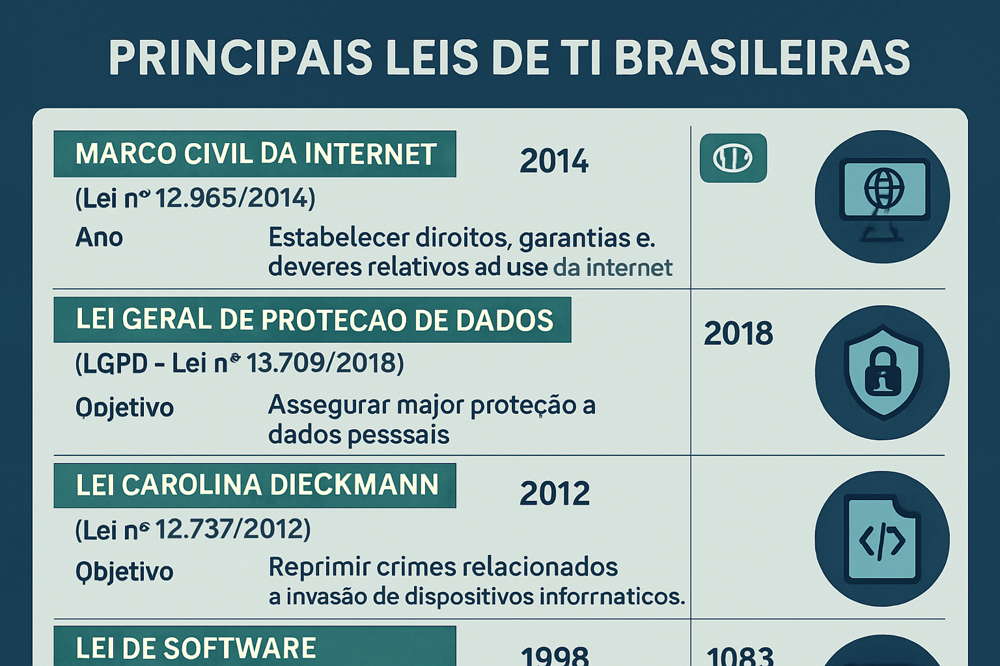

# Módulo 3: Direito Digital e Legislação Aplicada à TI

## Unidade 3.1: Noção Geral de Direito Digital

O Direito Digital é um ramo do direito que se dedica a estudar e regulamentar as relações jurídicas que surgem no ambiente digital. Com o avanço da tecnologia e a crescente digitalização da sociedade, novas questões legais surgem, exigindo um arcabouço jurídico que garanta a segurança, a privacidade, a liberdade de expressão e a proteção dos direitos no ciberespaço.

### Conceito e Abrangência do Direito Digital

O **Direito Digital** não é uma área isolada, mas sim um campo multidisciplinar que abrange diversas áreas do direito tradicional (civil, penal, empresarial, trabalhista, etc.) aplicadas ao contexto digital. Ele lida com temas como [14, 15]:

*   **Privacidade e Proteção de Dados:** Regulamentação da coleta, armazenamento, tratamento e compartilhamento de dados pessoais, com destaque para a Lei Geral de Proteção de Dados (LGPD).
*   **Crimes Cibernéticos:** Tipificação e combate a delitos praticados no ambiente digital, como fraudes eletrônicas, invasão de dispositivos, difamação online, pedofilia, entre outros.
*   **Comércio Eletrônico:** Aspectos legais das transações comerciais realizadas online, incluindo contratos eletrônicos, direitos do consumidor no ambiente digital e segurança das transações.
*   **Propriedade Intelectual:** Proteção de direitos autorais, marcas e patentes no ambiente digital, incluindo software, conteúdo multimídia e obras digitais.
*   **Contratos Digitais:** Validade e força probatória de contratos firmados eletronicamente.
*   **Responsabilidade Civil na Internet:** Responsabilidade de provedores de internet, usuários e plataformas por conteúdos e atos ilícitos praticados online.
*   **Liberdade de Expressão e Censura:** Equilíbrio entre a liberdade de expressão na internet e a necessidade de combater conteúdos ilegais ou ofensivos.

### Importância do Direito Digital para o Profissional de TI

Para o profissional de TI, o conhecimento em Direito Digital é cada vez mais crucial. A atuação em áreas como desenvolvimento de software, segurança da informação, gestão de redes e dados, e consultoria exige a compreensão das implicações legais de suas atividades. Ignorar as leis e regulamentos pode acarretar sérias consequências para a empresa e para o próprio profissional, incluindo multas, processos judiciais e danos à reputação [14, 15]:

*   **Desenvolvedores:** Precisam garantir que os sistemas e aplicativos desenvolvidos estejam em conformidade com as leis de proteção de dados e propriedade intelectual.
*   **Profissionais de Segurança da Informação:** Devem conhecer as leis de crimes cibernéticos e as regulamentações de segurança para proteger os dados e sistemas da empresa.
*   **Gestores de TI:** São responsáveis por garantir que toda a infraestrutura e os processos de TI estejam em conformidade com a legislação vigente.
*   **Analistas de Dados:** Precisam entender as regras de privacidade e uso de dados para realizar suas análises de forma ética e legal.

Em suma, o Direito Digital fornece as bases para uma atuação ética, segura e legal no ambiente tecnológico, sendo um conhecimento indispensável para qualquer profissional que atue ou pretenda atuar na área de Tecnologia da Informação.

**Referências:**

[14] Aurum. O que é Direito Digital e qual a sua importância? Disponível em: [https://www.aurum.com.br/blog/direito-digital/](https://www.aurum.com.br/blog/direito-digital/)

[15] Jusbrasil. O que é Direito Digital? Disponível em: [https://www.jusbrasil.com.br/artigos/o-que-e-direito-digital/175489446](https://www.jusbrasil.com.br/artigos/o-que-e-direito-digital/175489446)

### Questões de Múltipla Escolha - Unidade 3.1

**1. Qual das seguintes opções melhor descreve o Direito Digital?**

a) Um ramo do direito que lida exclusivamente com crimes cibernéticos.
b) Um campo multidisciplinar que abrange diversas áreas do direito tradicional aplicadas ao contexto digital.
c) Uma legislação específica para regulamentar o uso de softwares.
d) Um conjunto de normas que protege apenas a privacidade de dados.

Resposta

b) Um campo multidisciplinar que abrange diversas áreas do direito tradicional aplicadas ao contexto digital.

**2. Para o profissional de TI, o conhecimento em Direito Digital é crucial porque:**

a) Permite que ele ignore as leis, desde que não seja pego.
b) Garante que suas atividades estejam em conformidade com as leis e regulamentos, evitando consequências legais.
c) É uma habilidade técnica avançada que melhora o salário.
d) É útil apenas para advogados que trabalham com tecnologia.

Resposta

b) Garante que suas atividades estejam em conformidade com as leis e regulamentos, evitando consequências legais.

## Unidade 3.2: Principais Leis Brasileiras da Informática

O Brasil possui um conjunto de leis e regulamentações que buscam disciplinar o uso da tecnologia e proteger os direitos dos cidadãos no ambiente digital. Conhecer as principais leis brasileiras da informática é fundamental para empresas e profissionais de TI que atuam no país.

### Marco Civil da Internet (Lei nº 12.965/2014)

O **Marco Civil da Internet (MCI)**, promulgado em 2014, é considerado a "Constituição da Internet" no Brasil. Ele estabelece princípios, garantias, direitos e deveres para o uso da internet no país, com o objetivo de promover a liberdade de expressão, a privacidade, a neutralidade de rede e o desenvolvimento tecnológico [16, 17].

**Principais pontos:**

*   **Neutralidade de Rede:** Garante que os provedores de conexão não podem tratar de forma desigual os pacotes de dados, independentemente de seu conteúdo, origem, destino, serviço ou aplicação.
*   **Privacidade:** Protege a privacidade dos usuários, exigindo consentimento para a coleta e uso de dados pessoais e estabelecendo regras para o registro e guarda de logs de acesso.
*   **Liberdade de Expressão:** Assegura a liberdade de expressão, mas com responsabilidade, estabelecendo que a remoção de conteúdo só pode ser feita por ordem judicial, exceto em casos de nudez ou sexo sem consentimento.
*   **Responsabilidade dos Provedores:** Define a responsabilidade dos provedores de conexão e de aplicações por danos decorrentes de conteúdo gerado por terceiros.

### Lei Geral de Proteção de Dados (LGPD - Lei nº 13.709/2018)

A **Lei Geral de Proteção de Dados (LGPD)**, em vigor desde 2020, é um marco legal que estabelece regras sobre a coleta, armazenamento, tratamento e compartilhamento de dados pessoais por empresas e órgãos públicos. Seu principal objetivo é proteger os direitos fundamentais de liberdade e de privacidade e o livre desenvolvimento da personalidade da pessoa natural [18, 19].

**Principais pontos:**

*   **Dados Pessoais:** Define o que são dados pessoais (informações que identificam ou podem identificar uma pessoa natural) e dados pessoais sensíveis (dados sobre origem racial ou étnica, convicção religiosa, saúde, vida sexual, etc.).
*   **Bases Legais:** Exige que o tratamento de dados pessoais seja baseado em uma das dez bases legais previstas na lei (consentimento, cumprimento de obrigação legal, execução de contrato, legítimo interesse, etc.).
*   **Direitos dos Titulares:** Garante aos titulares dos dados diversos direitos, como acesso, correção, eliminação, portabilidade e revogação do consentimento.
*   **Agentes de Tratamento:** Define as figuras do controlador (quem decide sobre o tratamento) e do operador (quem realiza o tratamento em nome do controlador).
*   **ANPD:** Cria a Autoridade Nacional de Proteção de Dados (ANPD), órgão responsável por fiscalizar o cumprimento da lei e aplicar sanções.
*   **Sanções:** Prevê multas que podem chegar a 2% do faturamento da empresa, limitadas a R$ 50 milhões por infração, além de outras sanções administrativas.

### Lei Carolina Dieckmann (Lei nº 12.737/2012)

A **Lei Carolina Dieckmann**, promulgada em 2012, alterou o Código Penal brasileiro para tipificar crimes cibernéticos, como a invasão de dispositivos informáticos, interrupção de serviço telemático e falsificação de cartão de crédito ou débito. A lei recebeu esse nome popular após o vazamento de fotos íntimas da atriz Carolina Dieckmann, que teve seu computador invadido [20].

**Principais pontos:**

*   **Invasão de Dispositivo Informático:** Criminaliza a invasão de computadores, celulares ou outros dispositivos conectados à internet, com o objetivo de obter, adulterar ou destruir dados sem autorização.
*   **Interrupção de Serviço Telemático:** Tipifica a interrupção ou perturbação de serviço de utilidade pública, ou de serviço de telecomunicações.
*   **Falsificação de Cartão:** Criminaliza a falsificação de cartões de crédito ou débito.

### Lei do Software (Lei nº 9.609/1998)

A **Lei do Software**, de 1998, dispõe sobre a proteção da propriedade intelectual de programa de computador e sua comercialização no país. Ela equipara o software a uma obra literária para fins de proteção de direitos autorais, garantindo ao desenvolvedor o direito exclusivo de uso, cópia e distribuição de seu programa [21, 22].

**Principais pontos:**

*   **Proteção por Direitos Autorais:** O software é protegido como obra intelectual, independentemente de registro, por 50 anos a partir de 1º de janeiro do ano seguinte à sua publicação ou, na ausência desta, da sua criação.
*   **Registro no INPI:** Embora a proteção seja automática, o registro do software no Instituto Nacional da Propriedade Industrial (INPI) confere maior segurança jurídica e publicidade ao direito do titular.
*   **Licenciamento:** Regulamenta as formas de comercialização e licenciamento de software, permitindo que o titular autorize o uso por terceiros mediante contrato.

Essas leis, em conjunto, formam a base legal para a atuação no ambiente digital brasileiro, sendo essenciais para a Governança de TI e para a garantia de um ambiente online mais seguro e justo.

**Referências:**

[16] Planalto. Lei nº 12.965, de 23 de abril de 2014. Disponível em: [https://www.planalto.gov.br/ccivil_03/_ato2011-2014/2014/lei/l12965.htm](https://www.planalto.gov.br/ccivil_03/_ato2011-2014/2014/lei/l12965.htm)

[17] G1. Marco Civil da Internet: entenda a lei que completa 10 anos. Disponível em: [https://g1.globo.com/tecnologia/noticia/2024/04/23/marco-civil-da-internet-entenda-a-lei-que-completa-10-anos.ghtml](https://g1.globo.com/tecnologia/noticia/2024/04/23/marco-civil-da-internet-entenda-a-lei-que-completa-10-anos.ghtml)

[18] Planalto. Lei nº 13.709, de 14 de agosto de 2018. Disponível em: [https://www.planalto.gov.br/ccivil_03/_ato2015-2018/2018/lei/l13709.htm](https://www.planalto.gov.br/ccivil_03/_ato2015-2018/2018/lei/l13709.htm)

[19] Serpro. Lei Geral de Proteção de Dados Pessoais (LGPD). Disponível em: [https://www.serpro.gov.br/lgpd](https://www.serpro.gov.br/lgpd)

[20] Planalto. Lei nº 12.737, de 30 de novembro de 2012. Disponível em: [https://www.planalto.gov.br/ccivil_03/_ato2011-2014/2012/lei/l12737.htm](https://www.planalto.gov.br/ccivil_03/_ato2011-2014/2012/lei/l12737.htm)

[21] Planalto. Lei nº 9.609, de 19 de fevereiro de 1998. Disponível em: [https://www.planalto.gov.br/ccivil_03/leis/l9609.htm](https://www.planalto.gov.br/ccivil_03/leis/l9609.htm)

[22] INPI. Registro de Programa de Computador. Disponível em: [https://www.gov.br/inpi/pt-br/servicos/programas-de-computador](https://www.gov.br/inpi/pt-br/servicos/programas-de-computador)

### Questões de Múltipla Escolha - Unidade 3.2

**1. Qual das seguintes leis estabelece princípios, garantias, direitos e deveres para o uso da internet no Brasil?**

a) Lei Geral de Proteção de Dados (LGPD)
b) Lei Carolina Dieckmann
c) Marco Civil da Internet (MCI)
d) Lei do Software

Resposta

c) Marco Civil da Internet (MCI)

**2. A Lei Geral de Proteção de Dados (LGPD) prevê sanções para infrações que podem chegar a qual valor?**

a) R$ 1 milhão por infração.
b) R$ 10 milhões por infração.
c) R$ 50 milhões por infração.
d) R$ 100 milhões por infração.

Resposta

c) R$ 50 milhões por infração.

**3. A Lei Carolina Dieckmann tipifica crimes cibernéticos, como:**

a) Apenas a invasão de dispositivos informáticos.
b) Apenas a falsificação de cartão de crédito.
c) Invasão de dispositivos informáticos, interrupção de serviço telemático e falsificação de cartão de crédito ou débito.
d) Apenas a difamação online.

Resposta

c) Invasão de dispositivos informáticos, interrupção de serviço telemático e falsificação de cartão de crédito ou débito.

**4. A Lei do Software protege o programa de computador principalmente por qual regime jurídico?**

a) Patentes.
b) Marcas.
c) Direitos autorais.
d) Desenho industrial.

Resposta

c) Direitos autorais.

## Unidade 3.3: Registro de Software e Propriedade Intelectual

A proteção da propriedade intelectual no ambiente digital é um tema de crescente importância, especialmente para desenvolvedores e empresas de tecnologia. O software, como uma criação intelectual, possui um regime jurídico específico no Brasil, que garante direitos ao seu criador.

### Propriedade Intelectual e Software

A **Propriedade Intelectual** é um campo do direito que protege as criações da mente humana, concedendo aos criadores direitos exclusivos sobre suas invenções, obras literárias e artísticas, símbolos, nomes e imagens utilizados no comércio. No Brasil, a propriedade intelectual é regulamentada por diversas leis, incluindo a Lei de Direitos Autorais (Lei nº 9.610/98), a Lei da Propriedade Industrial (Lei nº 9.279/96) e a Lei do Software (Lei nº 9.609/98) [22].

O **software** é considerado uma obra intelectual e, no Brasil, sua proteção se dá principalmente pela **Lei do Software (Lei nº 9.609/98)**. Esta lei equipara o programa de computador a uma obra literária para fins de proteção de direitos autorais, garantindo ao seu criador o direito exclusivo de uso, cópia, distribuição e modificação [21, 22].

### Registro de Software no INPI

Embora a proteção do software por direitos autorais seja automática a partir de sua criação, o **registro do programa de computador no Instituto Nacional da Propriedade Industrial (INPI)** confere maior segurança jurídica ao titular. O registro não é obrigatório para a proteção, mas serve como uma prova robusta da autoria e da data de criação, facilitando a defesa dos direitos em caso de litígios [22].

**Vantagens do Registro:**

*   **Prova de Autoria:** O registro no INPI cria uma presunção de autoria, facilitando a comprovação da titularidade do software.
*   **Segurança Jurídica:** Oferece maior segurança jurídica para o titular, especialmente em casos de licenciamento, venda ou fusões e aquisições.
*   **Valorização do Ativo:** O software registrado é um ativo intangível que pode ser valorizado no balanço da empresa.
*   **Combate à Pirataria:** Facilita a tomada de medidas legais contra a cópia, distribuição ou uso não autorizado do software.
*   **Acesso a Incentivos:** Em alguns casos, o registro pode ser um requisito para acesso a linhas de financiamento ou incentivos fiscais.

**Processo de Registro (Simplificado):**

O processo de registro de software no INPI é eletrônico e relativamente simples. Basicamente, envolve [22]:

1.  **Depósito:** O titular deve depositar no INPI o código-fonte do programa (ou parte dele) e outras informações que o identifiquem.
2.  **Exame Formal:** O INPI verifica se a documentação está completa e em conformidade com as exigências.
3.  **Publicação:** Após o exame, o pedido é publicado na Revista da Propriedade Industrial (RPI).
4.  **Concessão:** Se não houver oposição ou se as oposições forem superadas, o registro é concedido.

É importante notar que o registro protege a expressão do software (o código), e não a ideia ou a funcionalidade em si. Para proteger a ideia ou a funcionalidade, outras formas de propriedade intelectual, como patentes, podem ser mais adequadas, embora patentes de software sejam um tema complexo e controverso em muitas jurisdições.

### Outras Formas de Propriedade Intelectual no Ambiente Digital

Além do software, outras criações no ambiente digital também são protegidas pela propriedade intelectual:

*   **Direitos Autorais:** Protegem obras literárias, artísticas e científicas, como textos, imagens, vídeos, músicas, websites e bancos de dados. A proteção é automática com a criação da obra.
*   **Marcas:** Protegem nomes, logotipos e símbolos que identificam produtos ou serviços no mercado. O registro de marcas é feito no INPI e confere o direito exclusivo de uso.
*   **Patentes:** Protegem invenções (produtos ou processos) que sejam novas, inventivas e passíveis de aplicação industrial. O processo de patenteamento é complexo e exige que a invenção seja detalhadamente descrita.
*   **Desenho Industrial:** Protege a forma plástica ornamental de um objeto ou o conjunto ornamental de linhas e cores que possa ser aplicado a um produto, conferindo-lhe aspecto novo e original.

Para o profissional de TI, compreender essas diferentes formas de proteção é fundamental para garantir que suas criações e as da empresa estejam devidamente protegidas, e para evitar a violação de direitos de terceiros.

**Referências:**

[21] Planalto. Lei nº 9.609, de 19 de fevereiro de 1998. Disponível em: [https://www.planalto.gov.br/ccivil_03/leis/l9609.htm](https://www.planalto.gov.br/ccivil_03/leis/l9609.htm)

[22] INPI. Registro de Programa de Computador. Disponível em: [https://www.gov.br/inpi/pt-br/servicos/programas-de-computador](https://www.gov.br/inpi/pt-br/servicos/programas-de-computador)

### Questões de Múltipla Escolha - Unidade 3.3

**1. Qual o principal benefício do registro de software no INPI?**

a) É obrigatório para a proteção de direitos autorais.
b) Confere maior segurança jurídica e prova de autoria.
c) Garante a patente da ideia do software.
d) Permite a cópia e distribuição ilimitada do software.

Resposta

b) Confere maior segurança jurídica e prova de autoria.

**2. A Lei do Software (Lei nº 9.609/1998) equipara o software a qual tipo de obra para fins de proteção de direitos autorais?**

a) Obra artística.
b) Obra musical.
c) Obra literária.
d) Obra científica.

Resposta

c) Obra literária.

## Unidade 3.4: Leis e Regulamentos que Impactam a TI (Lei SOX)

A Tecnologia da Informação (TI) opera em um ambiente regulatório cada vez mais complexo, com diversas leis e normas que visam garantir a segurança, privacidade, conformidade e ética no uso dos sistemas e dados. O cumprimento dessas regulamentações é fundamental para as organizações, especialmente em um cenário de crescente digitalização e preocupação com a proteção de informações.

### Lei Sarbanes-Oxley (SOX)

A **Lei Sarbanes-Oxley (SOX)**, promulgada nos Estados Unidos em 2002, é uma das legislações mais impactantes para a TI, especialmente para empresas de capital aberto que negociam em bolsas americanas, ou suas subsidiárias e filiais. Ela surgiu em resposta a escândalos financeiros (como Enron e WorldCom) e tem como objetivo restaurar a confiança do público nos mercados de capitais, aprimorando a governança corporativa e a responsabilidade das empresas [23].

A SOX prevê multas que variam de 1 milhão a 5 milhões de dólares e penas de reclusão entre 10 e 20 anos para os CEOs e CFOs que atestarem relatórios financeiros fraudulentos [23].

**Principais Impactos da SOX na TI:**

A SOX não se refere diretamente à TI, mas suas exigências de controle interno e relatórios financeiros precisos têm um impacto significativo nos sistemas e processos de TI. Para atender à conformidade com a SOX, as empresas precisam [24, 25]:

*   **Controles Internos sobre Relatórios Financeiros (ICFR):** A SOX exige que as empresas estabeleçam e mantenham controles internos eficazes sobre os relatórios financeiros. Isso implica que os sistemas de TI que suportam esses relatórios devem ser seguros, confiáveis e auditáveis. A TI precisa identificar os sistemas que suportam os reportes financeiros da empresa [25].
*   **Integridade e Segurança dos Dados:** Os dados financeiros devem ser íntegros, protegidos contra alterações não autorizadas e acessíveis apenas a pessoas autorizadas. Isso demanda controles rigorosos de acesso, criptografia e backups. O profissional de TI deve garantir que os sistemas tenham controle, segurança e rastreabilidade dos dados financeiros [24].
*   **Rastreabilidade e Auditoria:** Todas as transações e alterações nos sistemas que afetam os dados financeiros devem ser rastreáveis e auditáveis. Isso exige logs detalhados e a capacidade de reconstruir o histórico das informações.
*   **Segregação de Funções (SoD - Segregation of Duties):** As funções dentro dos sistemas de TI devem ser segregadas para evitar conflitos de interesse e reduzir o risco de fraudes. Por exemplo, a pessoa que desenvolve um sistema não deve ser a mesma que aprova as alterações em produção.
*   **Gestão de Mudanças:** As mudanças nos sistemas de TI devem ser controladas e documentadas, garantindo que apenas alterações autorizadas sejam implementadas e que não comprometam a integridade dos dados financeiros.
*   **Continuidade de Negócios e Recuperação de Desastres (BCDR - Business Continuity and Disaster Recovery):Sistemas de TI críticos devem ter planos de continuidade de negócios e recuperação de desastres para garantir que estejam sempre disponíveis e que os dados possam ser recuperados em caso de falhas.

O impacto da SOX nos processos de TI foi profundo, levando à reforma do processo de gestão e à necessidade de maior controle e governança sobre os sistemas de informação [23].

### Conformidade e Riscos de Não Cumprimento

A conformidade com a SOX e outras regulamentações é um componente crítico da Governança de TI. O não cumprimento pode acarretar sérias consequências para as organizações, incluindo:

*   **Penalidades Financeiras:** Multas elevadas, como as previstas pela SOX ou pela LGPD.
*   **Sanções Legais:** Processos judiciais, inquéritos e até mesmo penas de prisão para executivos, em casos de fraude ou negligência grave.
*   **Danos à Reputação:** Perda de confiança de clientes, investidores e parceiros de negócios, o que pode impactar negativamente o valor de mercado da empresa.
*   **Perda de Negócios:** Clientes podem optar por empresas que demonstram maior compromisso com a segurança e a privacidade de seus dados.
*   **Interrupção das Operações:** Em casos de violação de segurança ou falha de conformidade, as operações da empresa podem ser interrompidas, gerando perdas financeiras e operacionais.

Para mitigar esses riscos, as organizações devem implementar um robusto programa de compliance em TI, que inclua:

*   **Mapeamento de Requisitos:** Identificar todas as leis, regulamentos e padrões aplicáveis à TI da empresa.
*   **Avaliação de Riscos:** Analisar os riscos de não conformidade e seus potenciais impactos.
*   **Implementação de Controles:** Desenvolver e implementar controles internos nos sistemas e processos de TI para garantir a conformidade.
*   **Monitoramento Contínuo:** Monitorar regularmente a eficácia dos controles e a conformidade com as regulamentações.
*   **Auditorias Periódicas:** Realizar auditorias internas e externas para verificar a aderência às normas.
*   **Treinamento e Conscientização:** Capacitar os colaboradores sobre as políticas de segurança e privacidade e a importância da conformidade.

Em suma, a gestão da TI deve estar intrinsecamente ligada à conformidade regulatória, garantindo que a tecnologia seja utilizada de forma segura, ética e legal, protegendo os ativos da organização e a confiança dos stakeholders.

**Referências:**

[23] Treasy. Tudo sobre a Lei Sarbanes-Oxley, também conhecida como SOx. Disponível em: [https://www.treasy.com.br/blog/sox-lei-sarbanes-oxley/](https://www.treasy.com.br/blog/sox-lei-sarbanes-oxley/)

[24] LinkedIn. Como a Lei Sarbanes-Oxley impacta o profissional de TI no Brasil? Disponível em: [https://pt.linkedin.com/pulse/como-lei-sarbanes-oxley-impacta-o-profissional-de-ti-vasconcellos-zgikf](https://pt.linkedin.com/pulse/como-lei-sarbanes-oxley-impacta-o-profissional-de-ti-vasconcellos-zgikf)

[25] UniPTI. Governança de TI – aula 6 A lei Sarbanes-Oxley e seu impacto em TI. Disponível em: [https://unipti.files.wordpress.com/2011/09/govti-aula-6.pdf](https://unipti.files.wordpress.com/2011/09/govti-aula-6.pdf)

### Questões de Múltipla Escolha

**1. Qual das seguintes leis é conhecida como a "Constituição da Internet" no Brasil?**

a) Lei Geral de Proteção de Dados (LGPD)
b) Lei Carolina Dieckmann
c) Marco Civil da Internet (MCI)
d) Lei do Software

Resposta

c) Marco Civil da Internet (MCI)

**2. Qual o principal objetivo da Lei Geral de Proteção de Dados (LGPD)?**

a) Proteger a propriedade intelectual de programas de computador.
b) Tipificar crimes cibernéticos.
c) Proteger os direitos fundamentais de liberdade e de privacidade das pessoas naturais.
d) Regulamentar o comércio eletrônico.

Resposta

c) Proteger os direitos fundamentais de liberdade e de privacidade das pessoas naturais.

**3. O registro de software no INPI é obrigatório para a proteção dos direitos autorais de um programa de computador no Brasil?**

a) Sim, é obrigatório para que o software seja protegido.
b) Não, a proteção é automática, mas o registro confere maior segurança jurídica.
c) Sim, sem o registro, o software pode ser copiado livremente.
d) Não, o registro só é necessário para patentes de software.

Resposta

b) Não, a proteção é automática, mas o registro confere maior segurança jurídica.

**4. A Lei Sarbanes-Oxley (SOX) foi criada em resposta a quais eventos?**

a) Escândalos de privacidade de dados.
b) Ataques cibernéticos a grandes corporações.
c) Escândalos financeiros e contábeis.
d) Problemas de segurança em sistemas de TI.

Resposta

c) Escândalos financeiros e contábeis.

### Questões de Múltipla Escolha - Unidade 3.4

**1. Qual o principal objetivo da Lei Sarbanes-Oxley (SOX)?**

a) Regular a privacidade de dados pessoais.
b) Restaurar a confiança do público nos mercados de capitais, aprimorando a governança corporativa e a responsabilidade das empresas.
c) Tipificar crimes cibernéticos.
d) Proteger a propriedade intelectual de softwares.

Resposta

b) Restaurar a confiança do público nos mercados de capitais, aprimorando a governança corporativa e a responsabilidade das empresas.

**2. A SOX impacta a TI principalmente ao exigir:**

a) O desenvolvimento de novos softwares.
b) Controles internos robustos sobre os sistemas de informação que suportam os relatórios financeiros.
c) A contratação de mais profissionais de TI.
d) A migração de todos os sistemas para a nuvem.

Resposta

b) Controles internos robustos sobre os sistemas de informação que suportam os relatórios financeiros.

