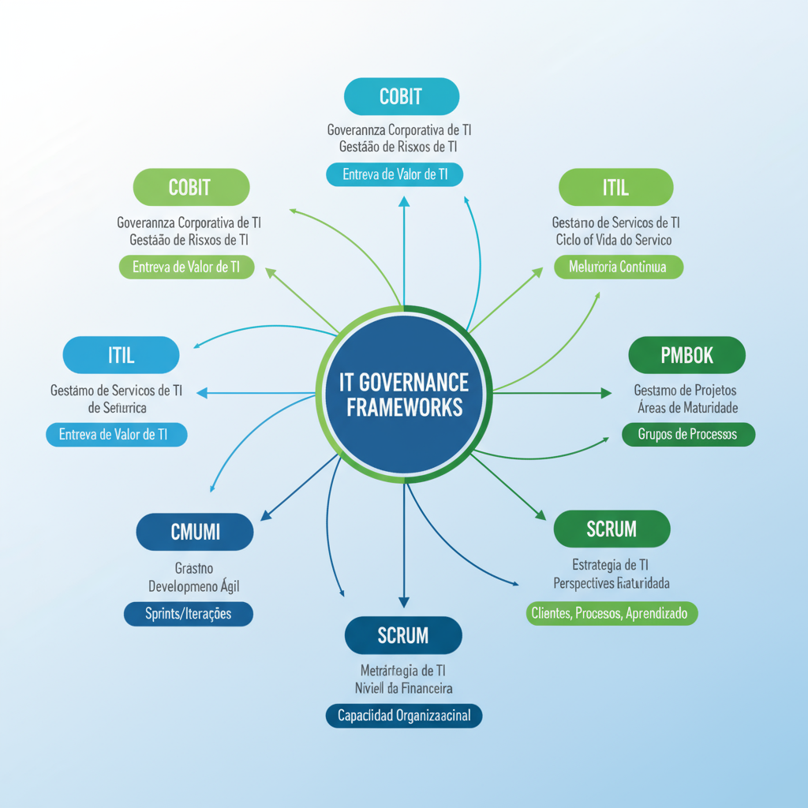

# Módulo 4: Frameworks e Modelos de Governança de TI

## Unidade 4.1: Conceitos de Arquétipos na GovTI

No campo da Governança de TI (GovTI), a forma como as decisões são tomadas e a autoridade é distribuída dentro de uma organização são aspectos cruciais que impactam diretamente a eficácia da TI. Para compreender essa dinâmica, o conceito de "arquétipos de governança" é fundamental. Esses arquétipos descrevem "quem" toma as decisões de TI e como a autoridade decisória é alocada.

### Modelos de Tomada de Decisão de TI

Os arquétipos de governança de TI mais conhecidos foram propostos por Peter Weill e Jeanne Ross em seu livro "IT Governance: How Top Performers Manage IT Decision Rights for Superior Results" (2004). Eles identificaram seis arquétipos que representam diferentes maneiras de alocar direitos decisórios sobre a TI [26, 27]:

1.  **Monarquia de Negócio (Business Monarchy):** Neste arquétipo, as decisões de TI são tomadas por um grupo de executivos de negócio (não-TI), como o CEO, CFO ou um comitê executivo. A TI tem um papel de suporte e execução das diretrizes definidas pelo negócio. Este modelo busca garantir que a TI esteja fortemente alinhada com as prioridades do negócio, mas pode levar a uma falta de compreensão técnica ou subutilização do potencial da TI [26, 27].
2.  **Monarquia de TI (IT Monarchy):** Aqui, as decisões de TI são tomadas por um grupo de executivos de TI. Isso pode levar a uma TI mais técnica e focada em eficiência e inovação tecnológica, mas com o risco de desalinhamento com as necessidades e prioridades do negócio. Pode gerar soluções tecnicamente excelentes, mas que não resolvem os problemas mais críticos da empresa [26, 27].
3.  **Feudalismo (Feudalism):** As decisões de TI são tomadas por líderes de unidades de negócio ou departamentos individuais. Cada área tem sua própria TI, o que pode gerar redundância de sistemas e infraestrutura, falta de padronização, dificuldade de integração e altos custos. Embora promova a agilidade local, a visão corporativa da TI é fragmentada [26, 27].
4.  **Federalismo (Federalism):** Este é um modelo híbrido e um dos mais desejáveis. As decisões de TI são tomadas por um grupo que inclui representantes de TI e de unidades de negócio. Busca equilibrar as perspectivas do negócio e da tecnologia, promovendo a colaboração e o alinhamento. As decisões são compartilhadas, aproveitando o conhecimento técnico da TI e a visão estratégica do negócio [26, 27].
5.  **Duopólio de TI (IT Duopoly):** As decisões de TI são tomadas por um grupo composto por um executivo de TI e um executivo de negócio. É um modelo de parceria forte entre TI e negócio, onde as decisões são compartilhadas e negociadas. É similar ao federalismo, mas com um número menor de decisores, o que pode agilizar o processo [26, 27].
6.  **Anarquia (Anarchy):** Neste cenário, não há um modelo claro ou formal de tomada de decisão de TI. Indivíduos ou pequenos grupos tomam suas próprias decisões com base em suas necessidades locais, sem coordenação central ou supervisão. Isso geralmente resulta em caos, ineficiência, altos riscos de segurança e conformidade, e um desalinhamento completo entre TI e negócio. É o arquétipo a ser evitado [26, 27].

### Impacto dos Arquétipos na Eficácia da Governança de TI

A escolha e a implementação de um arquétipo de governança têm um impacto significativo na eficácia da Governança de TI e, consequentemente, no desempenho da organização. A forma como a autoridade decisória é alocada influencia:

*   **Alinhamento Estratégico:** Arquétipos como o Federalismo e o Duopólio de TI tendem a promover um maior alinhamento entre a TI e os objetivos de negócio, pois as decisões são tomadas em conjunto, considerando ambas as perspectivas.
*   **Entrega de Valor:** Um arquétipo bem definido e implementado pode otimizar a entrega de valor da TI, garantindo que os investimentos gerem os resultados esperados para o negócio.
*   **Gestão de Riscos:** A clareza na tomada de decisões e a colaboração entre TI e negócio podem melhorar a identificação e mitigação de riscos relacionados à tecnologia.
*   **Eficiência e Inovação:** Modelos mais colaborativos podem fomentar a inovação, enquanto modelos muito centralizados (Monarquia de TI) podem ser eficientes tecnicamente, mas menos inovadores para o negócio, e modelos descentralizados (Feudalismo, Anarquia) são ineficientes e arriscados.
*   **Responsabilidade e Prestação de Contas:** A definição clara de quem decide e quem é responsável por cada tipo de decisão aumenta a prestação de contas e a transparência.

Idealmente, as organizações buscam um modelo que promova o alinhamento estratégico e a entrega de valor, muitas vezes gravitando em torno do federalismo ou duopólio, que incentivam a colaboração entre TI e negócio. A "anarquia" é geralmente o cenário a ser evitado, pois leva à ineficiência e ao desalinhamento [26].

Compreender esses arquétipos permite que as organizações avaliem seu modelo atual de governança de TI, identifiquem pontos fracos e fortes, e busquem otimizar a alocação de direitos decisórios para alcançar seus objetivos estratégicos de forma mais eficaz.

**Referências:**

[26] Arthur Schaefer. Governança de TI — 6 Arquétipos de TI. Disponível em: [https://www.arthurschaefer.com.br/2013/04/governanca-de-ti-6-arquetipos-de-ti/](https://www.arthurschaefer.com.br/2013/04/governanca-de-ti-6-arquetipos-de-ti/)

[27] Bridge Consulting. Arquétipos de Governança de TI: um caso prático de análise dos princípios de governança em uma organização de médio porte. Disponível em: [https://www.bridgeconsulting.com.br/artigos/arquetipos-de-governanca-de-ti-um-caso-pratico-de-analise-dos-principios-de-governanca-em-uma-organizacao-de-medio-porte/](https://www.bridgeconsulting.com.br/artigos/arquetipos-de-governanca-de-ti-um-caso-pratico-de-analise-dos-principios-de-governanca-em-uma-organizacao-de-medio-porte/)

### Questões de Múltipla Escolha - Unidade 4.1

**1. Qual arquétipo de governança de TI é caracterizado por decisões tomadas por líderes de unidades de negócio individuais, resultando em fragmentação da TI?**

a) Monarquia de Negócio
b) Monarquia de TI
c) Feudalismo
d) Federalismo

Resposta

c) Feudalismo

**2. O arquétipo "Federalismo" na Governança de TI envolve:**

a) Decisões tomadas exclusivamente por executivos de TI.
b) Decisões tomadas por um grupo que inclui representantes de TI e de unidades de negócio.
c) Ausência de um modelo claro de tomada de decisão.
d) Decisões tomadas apenas por executivos de negócio.

Resposta

b) Decisões tomadas por um grupo que inclui representantes de TI e de unidades de negócio.

## Unidade 4.2: Principais Decisões Críticas da GovTI

Para que a Governança de TI (GovTI) seja eficaz, é fundamental que as organizações compreendam e gerenciem as decisões críticas que moldam a forma como a tecnologia é utilizada e como ela contribui para os objetivos de negócio. Peter Weill e Jeanne Ross, em sua pesquisa sobre Governança de TI, identificaram cinco decisões críticas que toda organização precisa tomar em relação à sua TI [28]. Essas decisões, quando bem gerenciadas, são fundamentais para o sucesso da GovTI e para o alinhamento entre TI e negócio.

### As Cinco Decisões Críticas de TI

As cinco decisões críticas de TI são:

1.  **Princípios de TI (IT Principles):** Esta decisão define o papel da TI na organização. Ela estabelece as diretrizes gerais sobre como a TI deve ser usada para apoiar e impulsionar o negócio. Por exemplo, a TI deve ser um centro de custo, um facilitador de negócios ou um impulsionador de inovação? Esta decisão define a visão e a missão da TI na empresa, orientando todas as outras decisões e investimentos. É a base para o alinhamento estratégico [28].
2.  **Arquitetura de TI (IT Architecture):** Refere-se à organização lógica dos dados, aplicações e infraestrutura de TI. Esta decisão define os padrões tecnológicos e as plataformas que serão utilizadas na organização, buscando a padronização, integração e reutilização. Uma arquitetura bem definida evita a proliferação de sistemas incompatíveis, reduz a complexidade, garante a escalabilidade e a segurança, e facilita a inovação. Ela é crucial para a eficiência e a agilidade da TI [28].
3.  **Infraestrutura de TI (IT Infrastructure):** Esta decisão foca nos serviços de TI compartilhados que serão fornecidos à organização. Inclui a gestão de redes, servidores, armazenamento, segurança, serviços de comunicação e outros componentes que formam a base tecnológica da empresa. A infraestrutura deve ser robusta, confiável, segura e capaz de suportar as necessidades atuais e futuras do negócio. A decisão sobre a infraestrutura define a capacidade e a resiliência da TI [28].
4.  **Necessidades de Aplicações de Negócio (Business Application Needs):** Esta decisão determina as aplicações de software que a organização precisa para executar suas operações e atingir seus objetivos de negócio. Envolve a identificação, priorização, desenvolvimento ou aquisição e manutenção de sistemas que suportam processos de negócio específicos, como ERP (Enterprise Resource Planning), CRM (Customer Relationship Management), sistemas de RH, sistemas de produção, etc. Esta decisão garante que a TI entregue as ferramentas necessárias para o negócio [28].
5.  **Investimentos em TI e Priorização (IT Investment and Prioritization):** Esta decisão trata de como os recursos financeiros e humanos serão alocados para os projetos e iniciativas de TI. Envolve a definição de orçamentos, a avaliação de propostas de projetos, a priorização de investimentos e o monitoramento do retorno sobre o investimento (ROI) da TI. É crucial para garantir que os recursos sejam direcionados para as iniciativas que geram maior valor para o negócio e que os investimentos sejam feitos de forma eficiente e eficaz [28].

### Importância da Gestão dessas Decisões

A forma como essas cinco decisões são tomadas e quem as toma (os arquétipos de governança, conforme discutido na Unidade 4.1) tem um impacto direto na capacidade da TI de entregar valor ao negócio. Uma gestão eficaz dessas decisões críticas permite que as organizações:

*   **Alinhem a TI à Estratégia:** Garanta que os investimentos e as operações de TI estejam alinhados com os objetivos estratégicos da empresa, transformando a TI em um parceiro estratégico e não apenas um centro de custos.
*   **Otimizem o Valor:** Maximizem o valor gerado pela TI, garantindo que os recursos sejam utilizados de forma eficiente e que as soluções tecnológicas atendam às necessidades do negócio, contribuindo para a inovação e a competitividade.
*   **Gerenciem Riscos:** Identifiquem e mitiguem os riscos associados ao uso da TI, como riscos de segurança, operacionais e de conformidade, protegendo os ativos da organização.
*   **Melhorem a Eficiência:** Promovam a padronização, a integração e a reutilização de recursos, resultando em maior eficiência operacional e redução de custos.
*   **Aumentem a Transparência:** Forneçam clareza sobre as decisões de TI, promovendo a confiança e a colaboração entre as áreas.

Em suma, a gestão eficaz das decisões críticas de TI é um pilar fundamental da Governança de TI, garantindo que a tecnologia seja um motor de valor e inovação para a organização.

**Referências:**

[28] Bridge Consulting. As 5 Decisões Críticas de TI. Disponível em: [https://www.bridgeconsulting.com.br/artigos/as-5-decisoes-criticas-de-ti/](https://www.bridgeconsulting.com.br/artigos/as-5-decisoes-criticas-de-ti/)

### Questões de Múltipla Escolha - Unidade 4.2

**1. Qual das seguintes não é uma das cinco decisões críticas de TI identificadas por Peter Weill e Jeanne Ross?**

a) Princípios de TI
b) Arquitetura de TI
c) Marketing de TI
d) Investimentos em TI e Priorização

Resposta

c) Marketing de TI

**2. A decisão crítica de TI "Arquitetura de TI" refere-se a:**

a) Como os recursos financeiros serão alocados para projetos de TI.
b) A organização lógica dos dados, aplicações e infraestrutura de TI.
c) A definição do papel da TI na organização.
d) As aplicações de software que a organização precisa para executar suas operações.

Resposta

b) A organização lógica dos dados, aplicações e infraestrutura de TI.

## Unidade 4.3: Frameworks de Governança de TI: Características e Aplicações

Para auxiliar as organizações na implementação e gestão da Governança de TI, diversos frameworks e modelos foram desenvolvidos. Esses frameworks fornecem diretrizes, melhores práticas e estruturas que ajudam a alinhar a TI aos objetivos de negócio, gerenciar riscos e otimizar o valor dos investimentos em tecnologia. Nesta unidade, exploraremos os principais frameworks de Governança de TI e suas respectivas características e aplicações.

### COBIT (Control Objectives for Information and Related Technologies)

O **COBIT** é um framework de governança e gestão de TI desenvolvido pela ISACA (Information Systems Audit and Control Association). Ele fornece um conjunto abrangente de princípios, processos e práticas que ajudam as organizações a governar e gerenciar suas informações e tecnologias de forma eficaz. O COBIT é amplamente reconhecido por sua abordagem holística, que integra a governança de TI com a governança corporativa [29, 30].

**Principais Características:**

*   **Foco em Governança:** O COBIT é um framework de governança, o que significa que ele se concentra em garantir que a TI esteja alinhada aos objetivos de negócio e que os riscos sejam gerenciados de forma eficaz.
*   **Abrangência:** Cobre todo o ciclo de vida da TI, desde o planejamento estratégico até a operação e o monitoramento.
*   **Orientado a Processos:** Define 40 processos de governança e gestão de TI, organizados em domínios como Alinhar, Planejar e Organizar; Construir, Adquirir e Implementar; Entregar, Servir e Suportar; e Monitorar, Avaliar e Analisar.
*   **Flexibilidade:** Pode ser adaptado a diferentes tipos e tamanhos de organizações, e pode ser integrado com outros frameworks.

**Aplicações:**

*   Estabelecimento de um sistema de governança de TI.
*   Melhoria da gestão de riscos de TI.
*   Otimização do valor dos investimentos em TI.
*   Garantia de conformidade com regulamentações.

### ITIL (Information Technology Infrastructure Library)

O **ITIL** é um conjunto de práticas detalhadas para gerenciamento de serviços de TI (ITSM - IT Service Management). Ele se concentra em como a TI deve ser organizada para entregar valor ao negócio na forma de serviços. O ITIL não é um framework de governança, mas sim um framework de gestão de serviços que complementa a governança de TI [31, 32].

**Principais Características:**

*   **Foco em Serviços:** Concentra-se na entrega de serviços de TI de alta qualidade que atendam às necessidades do negócio.
*   **Ciclo de Vida do Serviço:** Estrutura as práticas de ITSM em um ciclo de vida que inclui Estratégia de Serviço, Desenho de Serviço, Transição de Serviço, Operação de Serviço e Melhoria Contínua de Serviço.
*   **Melhores Práticas:** Fornece um conjunto de melhores práticas para processos como gerenciamento de incidentes, gerenciamento de problemas, gerenciamento de mudanças, gerenciamento de capacidade, etc.

**Aplicações:**

*   Melhoria da qualidade e eficiência dos serviços de TI.
*   Otimização da gestão de incidentes e problemas.
*   Redução de custos operacionais da TI.
*   Aumento da satisfação do cliente com os serviços de TI.

### PMBOK (Project Management Body of Knowledge)

O **PMBOK** é um guia de conhecimento em gerenciamento de projetos desenvolvido pelo Project Management Institute (PMI). Ele não é específico para TI, mas suas práticas são amplamente aplicadas em projetos de tecnologia. O PMBOK fornece um conjunto de processos, ferramentas e técnicas para gerenciar projetos de forma eficaz [33].

**Principais Características:**

*   **Foco em Projetos:** Concentra-se no gerenciamento de projetos individuais, desde a iniciação até o encerramento.
*   **Áreas de Conhecimento:** Define 10 áreas de conhecimento (integração, escopo, tempo, custo, qualidade, recursos, comunicações, riscos, aquisições e partes interessadas) e 5 grupos de processos (iniciação, planejamento, execução, monitoramento e controle, e encerramento).
*   **Abordagem Preditiva:** Tradicionalmente, o PMBOK é associado a abordagens preditivas (cascata), mas também incorpora conceitos de abordagens ágeis.

**Aplicações:**

*   Planejamento e execução de projetos de TI.
*   Gestão de prazos, orçamentos e recursos em projetos.
*   Melhoria da taxa de sucesso de projetos de TI.

### CMMI (Capability Maturity Model Integration)

O **CMMI** é um modelo de melhoria de processos que fornece um guia para o desenvolvimento e manutenção de produtos e serviços. Ele ajuda as organizações a melhorar a qualidade de seus processos e a reduzir defeitos. O CMMI não é um framework de governança, mas pode ser usado para melhorar a maturidade dos processos de TI [34].

**Principais Características:**

*   **Foco em Processos:** Concentra-se na melhoria da maturidade dos processos de desenvolvimento de software e sistemas.
*   **Níveis de Maturidade:** Define 5 níveis de maturidade (Inicial, Gerenciado, Definido, Quantitativamente Gerenciado, Otimizado), que representam a capacidade de uma organização de gerenciar seus processos.
*   **Áreas de Processo:** Descreve áreas de processo que devem ser implementadas para alcançar cada nível de maturidade.

**Aplicações:**

*   Melhoria da qualidade do software e dos sistemas.
*   Redução de custos e prazos de desenvolvimento.
*   Aumento da previsibilidade e da eficiência dos processos.

### Scrum

**Scrum** é um framework ágil para gerenciamento de projetos, especialmente desenvolvimento de software. Ele é baseado em ciclos iterativos e incrementais (sprints) e promove a colaboração, a auto-organização e a entrega contínua de valor. Embora não seja um framework de governança, o Scrum pode ser usado para gerenciar projetos de TI de forma mais ágil e responsiva [35].

**Principais Características:**

*   **Agilidade e Flexibilidade:** Permite que as equipes se adaptem rapidamente às mudanças nos requisitos e prioridades.
*   **Iterativo e Incremental:** O trabalho é dividido em sprints curtos (geralmente de 1 a 4 semanas), com entregas incrementais de software funcionando.
*   **Papéis Definidos:** Define três papéis principais: Product Owner, Scrum Master e Time de Desenvolvimento.
*   **Eventos e Artefatos:** Possui eventos (sprint planning, daily scrum, sprint review, sprint retrospective) e artefatos (product backlog, sprint backlog, incremento).

**Aplicações:**

*   Desenvolvimento de software e sistemas.
*   Projetos com requisitos em constante mudança.
*   Equipes pequenas e auto-organizadas.

### BSC (Balanced Scorecard)

O **Balanced Scorecard (BSC)** é uma ferramenta de gestão estratégica que permite às organizações traduzir sua visão e estratégia em um conjunto abrangente de indicadores de desempenho. Ele não é um framework de TI, mas pode ser usado para medir o desempenho da TI e garantir o alinhamento com os objetivos de negócio [36].

**Principais Características:**

*   **Perspectivas Balanceadas:** Avalia o desempenho da organização sob quatro perspectivas: Financeira, Clientes, Processos Internos e Aprendizado e Crescimento.
*   **Mapas Estratégicos:** Permite a criação de mapas estratégicos que visualizam as relações de causa e efeito entre os objetivos e indicadores.
*   **Alinhamento Estratégico:** Ajuda a comunicar a estratégia da organização e a alinhar as ações de todos os níveis.

**Aplicações:**

*   Medição do desempenho da TI e seu alinhamento com o negócio.
*   Comunicação da estratégia de TI para a organização.
*   Identificação de lacunas de desempenho e oportunidades de melhoria.

### Integração e Complementaridade dos Frameworks

É importante notar que esses frameworks não são mutuamente exclusivos e podem ser utilizados de forma complementar. Por exemplo, uma organização pode usar o COBIT para a governança geral de TI, o ITIL para a gestão de serviços, o PMBOK para o gerenciamento de projetos e o Scrum para o desenvolvimento de software. A escolha e a combinação dos frameworks dependem das necessidades e do contexto de cada organização.

**Referências:**

[29] ISACA. COBIT 2019 Framework. Disponível em: [https://www.isaca.org/resources/cobit](https://www.isaca.org/resources/cobit)

[30] G2. O que é COBIT? Disponível em: [https://www.g2.com/pt-BR/glossary/cobit-definition](https://www.g2.com/pt-BR/glossary/cobit-definition)

[31] AXELOS. ITIL 4: The Framework for the Management of IT-Enabled Services. Disponível em: [https://www.axelos.com/certifications/itil-service-management](https://www.axelos.com/certifications/itil-service-management)

[32] G2. O que é ITIL? Disponível em: [https://www.g2.com/pt-BR/glossary/itil-definition](https://www.g2.com/pt-BR/glossary/itil-definition)

[33] PMI. Um Guia do Conhecimento em Gerenciamento de Projetos (Guia PMBOK). Disponível em: [https://www.pmi.org/pmbok-guide-standards/foundational/pmbok](https://www.pmi.org/pmbok-guide-standards/foundational/pmbok)

[34] CMMI Institute. CMMI for Development, Version 2.0. Disponível em: [https://cmmiinstitute.com/cmmi/dev](https://cmmiinstitute.com/cmmi/dev)

[35] Scrum.org. O que é Scrum? Disponível em: [https://www.scrum.org/resources/what-is-scrum](https://www.scrum.org/resources/what-is-scrum)

[36] Balanced Scorecard Institute. What is the Balanced Scorecard? Disponível em: [https://www.balancedscorecard.org/BSC-Basics/About-the-BSC](https://www.balancedscorecard.org/BSC-Basics/About-the-BSC)

### Questões de Múltipla Escolha

**1. Qual arquétipo de governança de TI é considerado um dos mais desejáveis por equilibrar as perspectivas de negócio e tecnologia?**

a) Monarquia de TI
b) Feudalismo
c) Federalismo
d) Anarquia

Resposta

c) Federalismo

**2. Qual das seguintes não é uma das cinco decisões críticas de TI identificadas por Peter Weill e Jeanne Ross?**

a) Princípios de TI
b) Arquitetura de TI
c) Gestão de Pessoas
d) Investimentos em TI e Priorização

Resposta

c) Gestão de Pessoas

**3. Qual framework de Governança de TI é amplamente reconhecido por sua abordagem holística e por integrar a governança de TI com a governança corporativa?**

a) ITIL
b) PMBOK
c) CMMI
d) COBIT

Resposta

d) COBIT

**4. O ITIL é um framework focado principalmente em:**

a) Gerenciamento de projetos.
b) Melhoria da maturidade de processos.
c) Gerenciamento de serviços de TI.
d) Governança de TI.

Resposta

c) Gerenciamento de serviços de TI.

### Questões de Múltipla Escolha - Unidade 4.3

**1. Qual framework é focado em governança e gestão de TI, com uma abordagem holística que integra a governança de TI com a governança corporativa?**

a) ITIL
b) PMBOK
c) COBIT
d) Scrum

Resposta

c) COBIT

**2. O ITIL é um conjunto de práticas detalhadas para qual área?**

a) Gerenciamento de projetos.
b) Gerenciamento de serviços de TI (ITSM).
c) Melhoria de processos de desenvolvimento de software.
d) Desenvolvimento ágil de software.

Resposta

b) Gerenciamento de serviços de TI (ITSM).

**3. Qual framework é um guia de conhecimento em gerenciamento de projetos, amplamente aplicado em projetos de tecnologia?**

a) CMMI
b) Scrum
c) COBIT
d) PMBOK

Resposta

d) PMBOK

**4. O CMMI é um modelo de melhoria de processos que define níveis de maturidade para qual finalidade?**

a) Gerenciar riscos de TI.
b) Melhorar a qualidade dos processos de desenvolvimento de software e sistemas.
c) Entregar serviços de TI de alta qualidade.
d) Alinhar a TI aos objetivos de negócio.

Resposta

b) Melhorar a qualidade dos processos de desenvolvimento de software e sistemas.

**5. Qual framework é ágil e focado em gerenciamento de projetos, especialmente desenvolvimento de software, com ciclos curtos e entregas incrementais?**

a) ITIL
b) PMBOK
c) Scrum
d) COBIT

Resposta

c) Scrum

