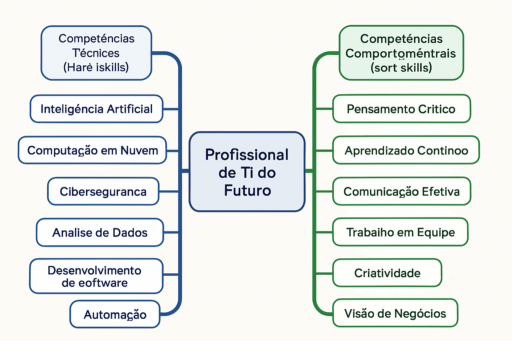

# Módulo 5: Novas Tecnologias e o Futuro da TI

## Unidade 5.1: Novas Tecnologias de Mercado de TI

O cenário da Tecnologia da Informação (TI) é caracterizado por uma evolução constante e acelerada. Novas tecnologias surgem e amadurecem rapidamente, transformando indústrias, criando novas oportunidades de negócio e exigindo que profissionais e organizações se mantenham em constante atualização. Compreender as principais tendências tecnológicas é fundamental para se manter relevante e competitivo no mercado de TI.

### Principais Tendências Tecnológicas e seus Impactos

1.  **Inteligência Artificial (IA) e Machine Learning (ML):**
    *   **Descrição:** A IA e o ML continuam a ser as tecnologias mais disruptivas. A IA permite que máquinas simulem a inteligência humana, enquanto o ML é um subcampo da IA que permite que sistemas aprendam com dados sem serem explicitamente programados. A **IA Generativa** (ex: ChatGPT, DALL-E), capaz de criar novos conteúdos (textos, imagens, músicas, vídeos), e a **IA Multimodal**, que processa e gera informações em diferentes formatos (texto, imagem, áudio), são as fronteiras atuais. Os **Agentes de IA**, sistemas autônomos que realizam tarefas complexas, também estão ganhando força [37, 38].
    *   **Impacto:** Automação de tarefas, personalização de experiências, otimização de processos, novas formas de interação humano-máquina, criação de conteúdo em escala.

2.  **Computação em Nuvem (Cloud Computing):**
    *   **Descrição:** A nuvem oferece infraestrutura, plataformas e software como serviço, permitindo acesso sob demanda a recursos computacionais. A tendência atual é a adoção de **ambientes híbridos e multicloud**, que combinam nuvens públicas e privadas de diferentes provedores para otimizar custos, desempenho, segurança e resiliência [37, 38].
    *   **Impacto:** Escalabilidade, flexibilidade, redução de custos de infraestrutura, agilidade no desenvolvimento e implantação de aplicações.

3.  **Cibersegurança Avançada:**
    *   **Descrição:** Com o aumento das ameaças cibernéticas, a cibersegurança evolui para incluir abordagens mais proativas e inteligentes. Isso envolve o uso de IA para detecção de anomalias, segurança de dados em ambientes multicloud, proteção contra ataques de ransomware e a crescente preocupação com a **segurança contra desinformação** e ataques a sistemas de IA [37, 38].
    *   **Impacto:** Proteção de dados sensíveis, garantia da continuidade dos negócios, mitigação de riscos de reputação e financeiros, conformidade regulatória.

4.  **Internet das Coisas (IoT) e Edge Computing:**
    *   **Descrição:** A IoT refere-se à rede de dispositivos físicos incorporados com sensores, software e outras tecnologias que se conectam e trocam dados pela internet. O **Edge Computing** processa dados mais perto da fonte (na "borda" da rede), reduzindo a latência e a necessidade de enviar todos os dados para a nuvem [37, 38].
    *   **Impacto:** Cidades inteligentes, automação industrial, saúde conectada, otimização de operações em tempo real, novas fontes de dados para análise.

5.  **Blockchain e Web3:**
    *   **Descrição:** O Blockchain é uma tecnologia de registro distribuído e imutável, conhecida por sua aplicação em criptomoedas. A **Web3** é um conceito de uma nova geração da internet descentralizada, construída sobre tecnologias como blockchain, NFTs (Non-Fungible Tokens) e contratos inteligentes, visando maior controle do usuário sobre seus dados e ativos digitais [37, 38].
    *   **Impacto:** Transparência e segurança em transações, rastreabilidade em cadeias de suprimentos, novas formas de propriedade digital, descentralização de aplicações.

6.  **Computação Quântica:**
    *   **Descrição:** Ainda em estágio inicial, a computação quântica utiliza princípios da mecânica quântica para resolver problemas complexos que estão além da capacidade dos computadores clássicos. Embora não substitua a computação tradicional, ela tem o potencial de revolucionar áreas como criptografia, descoberta de medicamentos e otimização [37, 38].
    *   **Impacto:** Capacidade de resolver problemas atualmente intratáveis, quebra de criptografias atuais (levando à necessidade de **Criptografia Pós-Quântica**), avanços em pesquisa científica.

7.  **Desenvolvimento Low-Code e No-Code:**
    *   **Descrição:** Plataformas Low-Code e No-Code permitem que usuários com pouca ou nenhuma experiência em programação criem aplicações e automatizem processos por meio de interfaces visuais e componentes pré-construídos. Isso acelera o desenvolvimento e democratiza a criação de software [37, 38].
    *   **Impacto:** Agilidade no desenvolvimento, redução da dependência de desenvolvedores especializados, empoderamento de usuários de negócio, prototipagem rápida.

### A Importância da Adaptação e Aprendizado Contínuo

A rápida evolução tecnológica exige que profissionais e organizações adotem uma mentalidade de **aprendizado contínuo** e **adaptabilidade**. O que é relevante hoje pode ser obsoleto amanhã. Portanto, é crucial:

*   **Monitorar Tendências:** Acompanhar as pesquisas, relatórios de mercado (Gartner, Forrester) e notícias do setor.
*   **Experimentar:** Testar novas tecnologias em pequena escala para entender seu potencial e desafios.
*   **Desenvolver Novas Habilidades:** Investir em capacitação e requalificação para dominar as tecnologias emergentes.
*   **Promover a Inovação:** Criar um ambiente que incentive a experimentação e a busca por soluções inovadoras.

O futuro da TI é dinâmico e cheio de possibilidades. Aqueles que estiverem preparados para abraçar a mudança e se adaptar às novas realidades tecnológicas serão os protagonistas da próxima era de inovação.

**Referências:**

[37] Canaltech. 10 principais tendências de tecnologia para 2023. Disponível em: [https://canaltech.com.br/inovacao/10-principais-tendencias-de-tecnologia-para-2023-231005/](https://canaltech.com.br/inovacao/10-principais-tendencias-de-tecnologia-para-2023-231005/)

[38] Gartner. Top Strategic Technology Trends for 2023. Disponível em: [https://www.gartner.com/en/information-technology/insights/top-technology-trends](https://www.gartner.com/en/information-technology/insights/top-technology-trends)

### Questões de Múltipla Escolha - Unidade 5.1

**1. Qual das seguintes tecnologias é caracterizada pela capacidade de criar novos conteúdos (textos, imagens, músicas)?**

a) Computação em Nuvem
b) Internet das Coisas (IoT)
c) Inteligência Artificial Generativa
d) Cibersegurança

Resposta

c) Inteligência Artificial Generativa

**2. O que o Edge Computing busca otimizar?**

a) O armazenamento centralizado de dados.
b) O processamento de dados mais próximo da fonte.
c) A criação de criptomoedas.
d) O desenvolvimento de software Low-Code.

Resposta

b) O processamento de dados mais próximo da fonte.

## Unidade 5.2: Sustentabilidade e Ética na TI

À medida que a Tecnologia da Informação (TI) se torna cada vez mais onipresente e poderosa, cresce também a responsabilidade de utilizá-la de forma ética e sustentável. A discussão sobre o impacto ambiental da TI (TI Verde) e os dilemas éticos levantados por tecnologias como a Inteligência Artificial (IA) são cruciais para o futuro da área.

### TI Verde (Green IT)

A **TI Verde (Green IT)** refere-se a um conjunto de práticas e iniciativas que visam reduzir o impacto ambiental das operações de Tecnologia da Informação. O objetivo é tornar a TI mais eficiente em termos de energia, menos poluente e mais sustentável em todo o seu ciclo de vida, desde a fabricação dos equipamentos até o descarte [39].

**Principais Pilares da TI Verde:**

1.  **Eficiência Energética:** Redução do consumo de energia por equipamentos de TI (servidores, computadores, data centers) através de virtualização, consolidação de servidores, uso de hardware mais eficiente e fontes de energia renováveis.
2.  **Gerenciamento de Resíduos Eletrônicos (E-waste):** Descarte adequado e reciclagem de equipamentos eletrônicos, minimizando o impacto ambiental e promovendo a reutilização de materiais.
3.  **Design Sustentável:** Desenvolvimento de hardware e software com foco na durabilidade, reparabilidade e menor consumo de recursos.
4.  **Virtualização e Computação em Nuvem:** A virtualização de servidores e a migração para a nuvem podem reduzir significativamente o número de equipamentos físicos e o consumo de energia dos data centers.
5.  **Teletrabalho e Colaboração Remota:** A tecnologia permite o trabalho remoto, reduzindo a necessidade de deslocamento e, consequentemente, a emissão de carbono.

**Benefícios da TI Verde:**

*   **Redução de Custos:** Menor consumo de energia e otimização de recursos resultam em economia financeira.
*   **Sustentabilidade Ambiental:** Diminuição da pegada de carbono e do impacto ambiental da TI.
*   **Melhora da Imagem Corporativa:** Empresas com práticas de TI Verde são vistas como mais responsáveis e sustentáveis.
*   **Conformidade Regulatória:** Atendimento a normas e regulamentações ambientais.

### Ética na Inteligência Artificial (IA)

A Inteligência Artificial, com seu poder de processar grandes volumes de dados e tomar decisões, levanta uma série de questões éticas complexas que precisam ser abordadas. A falta de considerações éticas no desenvolvimento e uso da IA pode levar a consequências negativas, como discriminação, perda de privacidade e decisões injustas [40, 41].

**Dilemas Éticos da IA:**

*   **Viés Algorítmico:** Sistemas de IA podem reproduzir e até amplificar preconceitos existentes nos dados com os quais foram treinados, levando a decisões discriminatórias em áreas como recrutamento, concessão de crédito ou justiça criminal.
*   **Privacidade e Vigilância:** A capacidade da IA de coletar e analisar grandes volumes de dados pessoais levanta preocupações sobre a privacidade e o potencial de vigilância em massa.
*   **Responsabilidade:** Quem é responsável por erros ou danos causados por sistemas autônomos de IA? O desenvolvedor, o operador, o usuário?
*   **Transparência e Explicabilidade:** Muitos modelos de IA são "caixas pretas", tornando difícil entender como chegaram a uma determinada decisão. Isso dificulta a auditoria, a identificação de vieses e a garantia de justiça.
*   **Impacto no Emprego:** A automação impulsionada pela IA pode levar à substituição de empregos, exigindo políticas de requalificação e adaptação da força de trabalho.
*   **Autonomia e Controle:** À medida que a IA se torna mais autônoma, surgem questões sobre o nível de controle humano necessário e os riscos de sistemas agirem de forma não intencional ou prejudicial.

### Governança de IA e Princípios Éticos

Para mitigar os riscos e garantir que a IA seja desenvolvida e utilizada de forma responsável, a **Governança de IA** e a adoção de princípios éticos são fundamentais. Diversas organizações e governos têm proposto diretrizes para uma IA ética, baseadas em princípios como [40, 41]:

1.  **Justiça e Equidade:** A IA deve ser desenvolvida e utilizada de forma a evitar a discriminação e promover a equidade, garantindo que os benefícios sejam distribuídos de forma justa.
2.  **Transparência e Explicabilidade:** Os sistemas de IA devem ser compreensíveis e auditáveis, permitindo que os usuários e reguladores entendam como as decisões são tomadas.
3.  **Responsabilidade e Prestação de Contas:** Deve haver clareza sobre quem é responsável pelas ações e decisões dos sistemas de IA, e mecanismos para responsabilização em caso de falhas.
4.  **Privacidade e Segurança:** A IA deve respeitar a privacidade dos dados e garantir a segurança das informações, em conformidade com as leis de proteção de dados.
5.  **Controle Humano:** Os humanos devem manter o controle sobre os sistemas de IA, com a capacidade de intervir e desativar sistemas quando necessário.
6.  **Beneficência e Não Maleficência:** A IA deve ser usada para o bem da humanidade, promovendo o bem-estar e evitando danos.

A implementação de uma Governança de IA eficaz envolve a criação de políticas internas, a formação de comitês de ética, a realização de auditorias de algoritmos e a capacitação de equipes para desenvolver e usar a IA de forma responsável. A ética e a sustentabilidade não são apenas questões de conformidade, mas também de responsabilidade social e de construção de confiança na era digital.

**Referências:**

[39] Green IT. O que é TI Verde? Disponível em: [https://www.greenit.com.br/o-que-e-ti-verde/](https://www.greenit.com.br/o-que-e-ti-verde/)

[40] UNESCO. Recommendation on the Ethics of Artificial Intelligence. Disponível em: [https://en.unesco.org/artificial-intelligence/ethics](https://en.unesco.org/artificial-intelligence/ethics)

[41] McKinsey & Company. An executive’s guide to AI ethics. Disponível em: [https://www.mckinsey.com/capabilities/quantumblack/our-insights/an-executives-guide-to-ai-ethics](https://www.mckinsey.com/capabilities/quantumblack/our-insights/an-executives-guide-to-ai-ethics)

### Questões de Múltipla Escolha - Unidade 5.2

**1. Qual o principal objetivo da TI Verde (Green IT)?**

a) Aumentar o consumo de energia dos data centers.
b) Reduzir o impacto ambiental das operações de Tecnologia da Informação.
c) Focar apenas no descarte de equipamentos eletrônicos.
d) Desenvolver softwares mais complexos.

Resposta

b) Reduzir o impacto ambiental das operações de Tecnologia da Informação.

**2. Qual dos seguintes não é um dilema ético comum associado à Inteligência Artificial (IA)?**

a) Viés Algorítmico.
b) Transparência e Explicabilidade.
c) Aumento da velocidade da internet.
d) Responsabilidade por erros da IA.

Resposta

c) Aumento da velocidade da internet.

## Unidade 5.3: Perspectivas e o Profissional de TI do Futuro

O cenário tecnológico em constante transformação exige que o profissional de TI do futuro esteja preparado para novos desafios e oportunidades. Mais do que nunca, a combinação de habilidades técnicas (hard skills) com habilidades comportamentais (soft skills) será crucial para o sucesso e a relevância no mercado de trabalho.

### O Profissional de TI do Futuro: Habilidades Essenciais

1.  **Habilidades Técnicas (Hard Skills):**
    *   **Inteligência Artificial e Machine Learning:** Compreensão dos fundamentos, capacidade de trabalhar com modelos de IA e ML, e aplicação em problemas de negócio.
    *   **Computação em Nuvem:** Conhecimento aprofundado em plataformas de nuvem (AWS, Azure, Google Cloud), arquitetura de soluções em nuvem e migração.
    *   **Cibersegurança:** Expertise em proteção de dados, segurança de redes, detecção de ameaças e resposta a incidentes.
    *   **Análise de Dados e Big Data:** Capacidade de coletar, processar, analisar e interpretar grandes volumes de dados para extrair insights e apoiar a tomada de decisões.
    *   **Desenvolvimento de Software:** Proficiência em linguagens de programação relevantes, metodologias ágeis (DevOps, Scrum) e arquiteturas de microsserviços.
    *   **Automação e Robótica:** Conhecimento em automação de processos (RPA), automação de infraestrutura e robótica.

2.  **Habilidades Comportamentais (Soft Skills):**
    *   **Pensamento Crítico e Resolução de Problemas:** Capacidade de analisar situações complexas, identificar a causa raiz dos problemas e propor soluções inovadoras e eficazes.
    *   **Aprendizado Contínuo (Lifelong Learning):** A velocidade das mudanças tecnológicas exige uma mentalidade de aprendizado constante e a capacidade de se adaptar rapidamente a novas ferramentas e conceitos.
    *   **Comunicação Eficaz:** Habilidade de comunicar ideias técnicas complexas de forma clara e concisa para públicos técnicos e não técnicos, além de saber ouvir e colaborar.
    *   **Trabalho em Equipe e Colaboração:** A complexidade dos projetos de TI exige colaboração intensa entre equipes multidisciplinares e com as áreas de negócio.
    *   **Criatividade e Inovação:** Capacidade de pensar "fora da caixa", propor novas soluções e impulsionar a inovação.
    *   **Visão de Negócio:** Compreensão dos objetivos, processos e desafios do negócio, permitindo que a TI atue de forma estratégica e agregue valor real.
    *   **Ética e Responsabilidade:** Consciência sobre as implicações éticas e sociais da tecnologia, especialmente em áreas como IA e privacidade de dados.

### Perspectivas de Carreira e Áreas em Alta Demanda

O mercado de TI continua aquecido, com diversas áreas em alta demanda e novas oportunidades surgindo constantemente. Algumas das perspectivas de carreira mais promissoras incluem [42, 43]:

*   **Especialista em Inteligência Artificial/Machine Learning:** Cientistas de dados, engenheiros de ML, especialistas em processamento de linguagem natural.
*   **Engenheiro de Cloud:** Arquitetos de soluções em nuvem, engenheiros de DevOps, especialistas em segurança de nuvem.
*   **Especialista em Cibersegurança:** Analistas de segurança, engenheiros de segurança, consultores de GRC (Governança, Risco e Compliance).
*   **Analista de Dados/Engenheiro de Dados:** Profissionais que coletam, limpam, processam e analisam grandes volumes de dados.
*   **Desenvolvedor de Software:** Especialistas em diversas linguagens e plataformas, com foco em desenvolvimento web, mobile e backend.
*   **Arquiteto de Soluções:** Profissionais que projetam e implementam soluções tecnológicas complexas.
*   **Gerente de Projetos/Produtos de TI:** Líderes que gerenciam o ciclo de vida de projetos e produtos tecnológicos.
*   **Especialista em IoT:** Engenheiros e desenvolvedores focados em soluções para dispositivos conectados.

### A Importância da Visão Estratégica e da Governança de TI

Para o profissional de TI do futuro, não basta apenas dominar as tecnologias; é fundamental ter uma **visão estratégica** e compreender o papel da **Governança de TI**. Isso significa:

*   **Alinhar a TI ao Negócio:** Entender como a tecnologia pode impulsionar os objetivos de negócio e traduzir as necessidades do negócio em soluções tecnológicas.
*   **Gerenciar Riscos:** Identificar e mitigar os riscos associados ao uso da tecnologia, garantindo a segurança e a conformidade.
*   **Otimizar Investimentos:** Assegurar que os investimentos em TI gerem valor e retorno para a organização.
*   **Promover a Inovação Responsável:** Liderar a adoção de novas tecnologias de forma ética e sustentável.

O profissional de TI do futuro será um agente de transformação, capaz de navegar em um ambiente complexo e dinâmico, utilizando a tecnologia para resolver problemas, criar valor e impulsionar a inovação de forma responsável e estratégica.

**Referências:**

[42] Robert Half. As 10 profissões de TI mais promissoras para 2023. Disponível em: [https://www.roberthalf.com.br/blog/tendencias/as-10-profissoes-de-ti-mais-promissoras-para-2023](https://www.roberthalf.com.br/blog/tendencias/as-10-profissoes-de-ti-mais-promissoras-para-2023)

[43] Gupy. Profissões de TI: 10 áreas em alta no mercado de trabalho. Disponível em: [https://www.gupy.io/blog/profissoes-de-ti](https://www.gupy.io/blog/profissoes-de-ti)

### Questões de Múltipla Escolha

**1. Qual das seguintes tecnologias é caracterizada pela capacidade de criar novos conteúdos (textos, imagens, músicas)?**

a) Computação em Nuvem
b) Internet das Coisas (IoT)
c) Inteligência Artificial Generativa
d) Blockchain

Resposta

c) Inteligência Artificial Generativa

**2. O que o conceito de "Edge Computing" busca otimizar?**

a) O armazenamento centralizado de dados em nuvem.
b) O processamento de dados mais próximo da fonte.
c) A segurança de redes corporativas.
d) A criação de criptomoedas.

Resposta

b) O processamento de dados mais próximo da fonte.

**3. Qual dos seguintes não é um pilar fundamental da TI Verde (Green IT)?**

a) Eficiência Energética
b) Gerenciamento de Resíduos Eletrônicos
c) Aumento do consumo de hardware
d) Virtualização e Computação em Nuvem

Resposta

c) Aumento do consumo de hardware

**4. Qual das seguintes habilidades é considerada uma "soft skill" crucial para o profissional de TI do futuro?**

a) Proficiência em linguagens de programação.
b) Conhecimento em arquitetura de soluções em nuvem.
c) Pensamento crítico e aprendizado contínuo.
d) Expertise em cibersegurança.

Resposta

c) Pensamento crítico e aprendizado contínuo.

### Questões de Múltipla Escolha - Unidade 5.3

**1. Qual das seguintes habilidades é considerada uma "soft skill" essencial para o profissional de TI do futuro?**

a) Conhecimento em Linguagens de Programação.
b) Habilidade de Pensamento Crítico e Resolução de Problemas.
c) Expertise em Computação em Nuvem.
d) Proficiência em Cibersegurança.

Resposta

b) Habilidade de Pensamento Crítico e Resolução de Problemas.

**2. Qual área de carreira em TI está em alta demanda e exige profissionais capazes de coletar, processar, analisar e interpretar grandes volumes de dados?**

a) Desenvolvedor de Software.
b) Especialista em IoT.
c) Analista de Dados/Engenheiro de Dados.
d) Gerente de Projetos de TI.

Resposta

c) Analista de Dados/Engenheiro de Dados.

